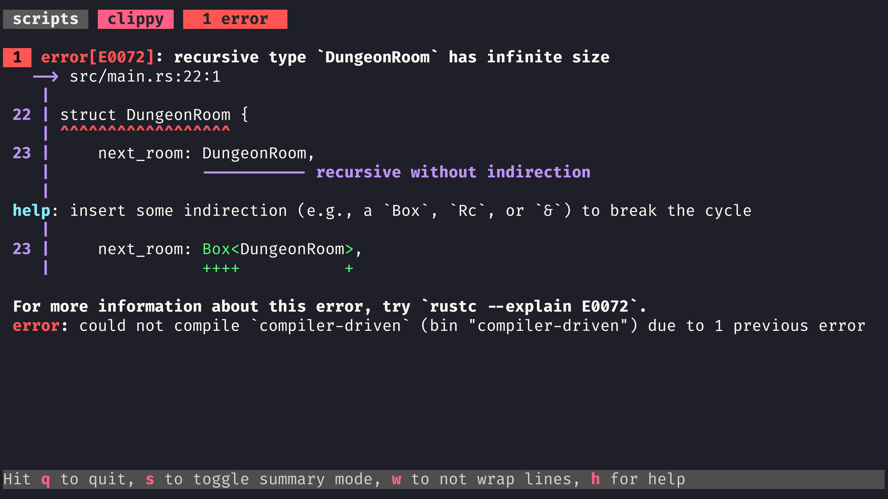
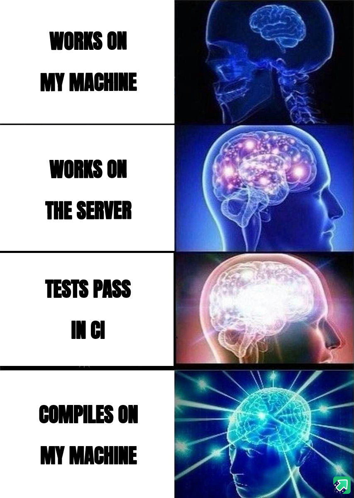
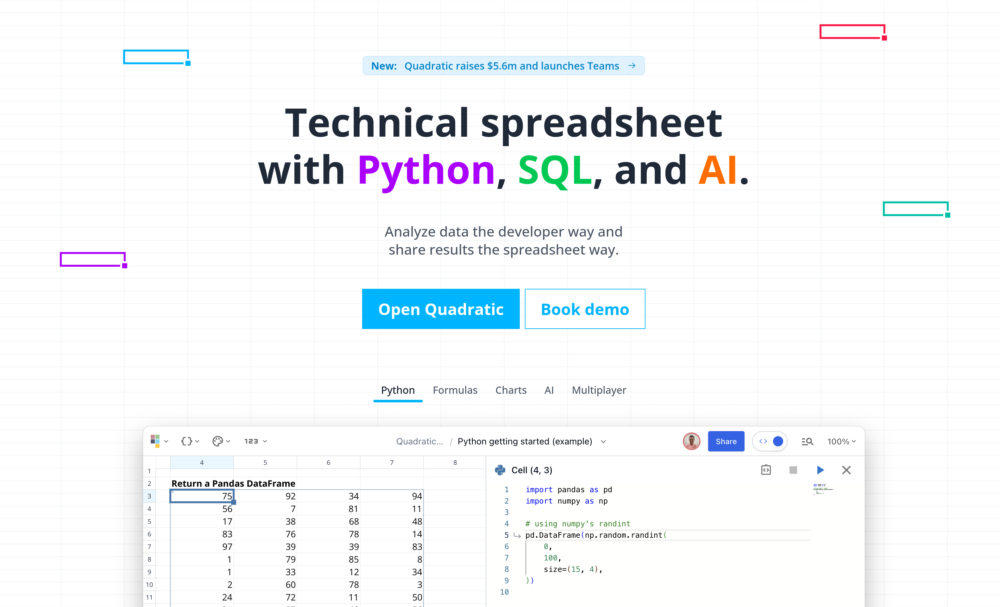
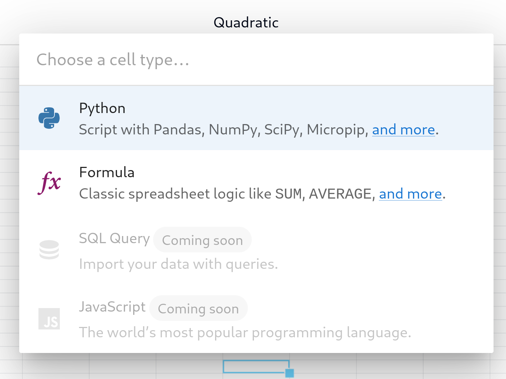
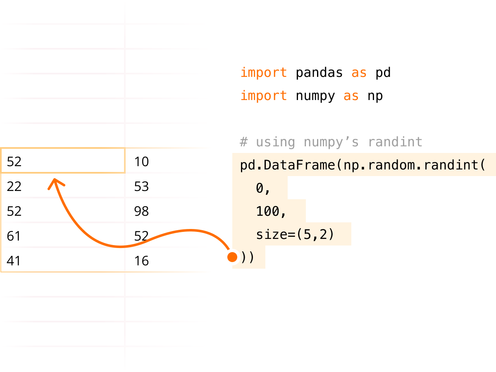
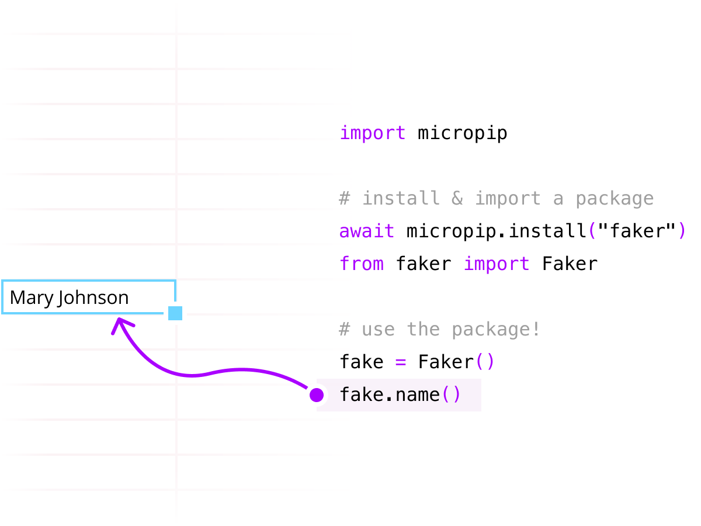
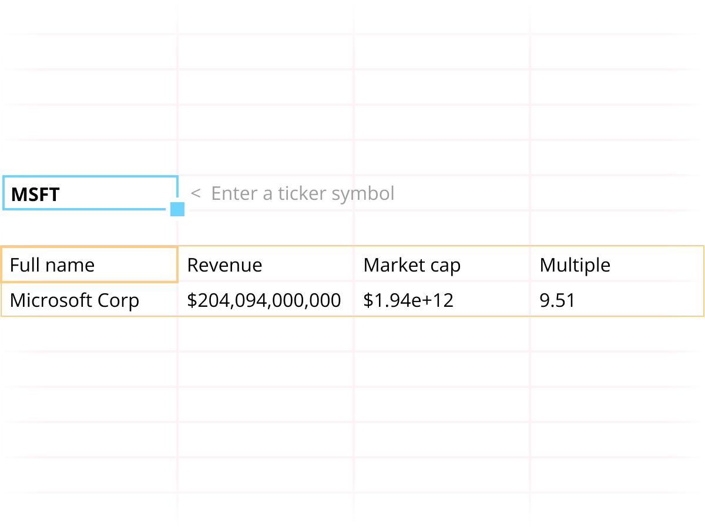
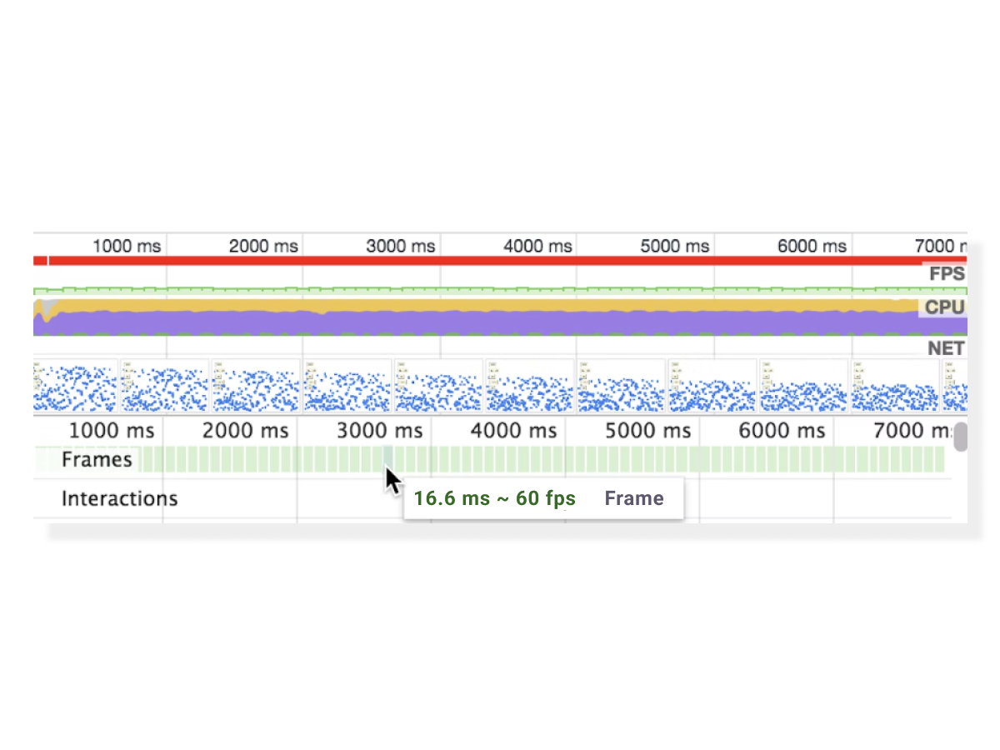
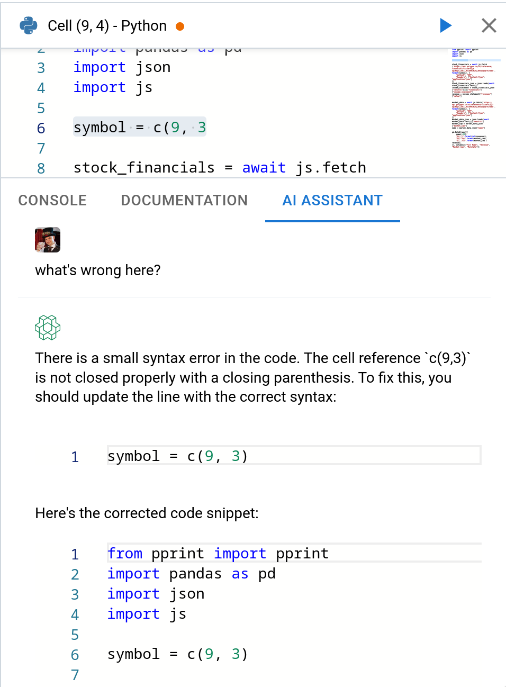
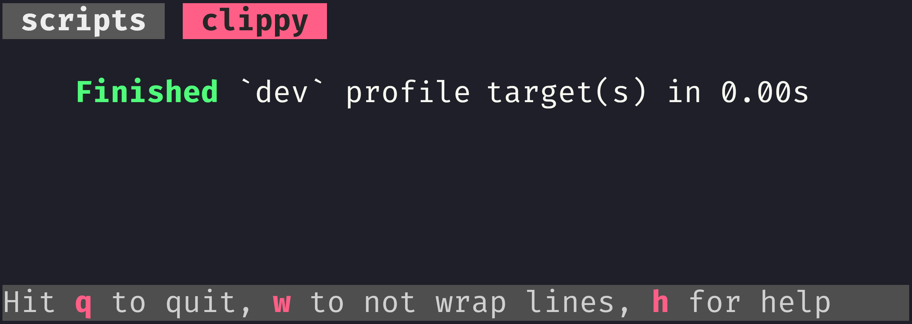

<style>
:root {--r-code-font: "FiraCode Nerd Font";}
.reveal .hljs {min-height: 50%;}
</style>

%%
f7f7f7 background slide colour
or maybe 191919

# Cargo.toml

```toml
[package]
name = "compiler-driven"
version = "0.1.0"
edition = "2021"

[build-dependencies]

[dev-dependencies]

[dependencies]
http = "1.0"

[lints.rust]
unsafe_code = "forbid"

# come at me, clippy
[lints.clippy]
enum_glob_use = "deny"
pedantic = { level = "deny", priority = -1 }
nursery = { level = "deny", priority = -1 }
unwrap_used = "deny"
```

# Lint Tweaks

These lints make clippy less noisy when I'm building the video

```rust
#![allow(dead_code, unused_variables)]
#![allow(clippy::items_after_statements, clippy::no_effect, unused_must_use, clippy::must_use_candidate, clippy::unused_self, clippy::missing_const_for_fn, clippy::use_self)]
```

# Imports

```rust
```

# Setup

```rust
fn main() {
	println!("Rust talk");
}
```

some new lines

%%

---


## Compiler-Driven Development in Rust

notes:

Hi friends my name is Tris and this is No Boilerplate, focusing on fast, technical videos.

Today I'm going to explain the alien magic of Compiler-Driven Development by analogy to Test-Driven Development, demo two examples in Rust, and make some recommendations.

When I begin a new Rust program, I don't start with functions or methods or any runtime code:
I start with the model of my application, expressed with Rust's rich type system.

Interacting with the real-world, on disk or through the network is too slow for me, at first, I need to iterate faster than that, to sketch out my ideas, unconstrained by the outside world.

_This compile-checked whiteboarding is called **_Compiler-Driven Development._**

---

### Don't just run your code, Model it

```rust
pub enum StatusCode {
    Ok = 200,
    NotFound = 404 // etc
}
struct Metadata {
    status: StatusCode,
    header_map: http::header::HeaderMap
}
struct HttpResponse<S: ResponseState> {
    state: Box<dyn ResponseState>,
    extra: S,
}
trait ResponseState {}
impl ResponseState for Metadata {}
```

[cliffle.com/blog/rust-typestate/](https://cliffle.com/blog/rust-typestate/) (stay tuned for demo)

notes:
You may be familiar with repl-driven development, or the fast feedback of testing out your code in the browser with hot code reloading.

The compiler is faster than all these methods, but to be fair, and balanced, it's because it's doing less.
Pure model code, the heart of the plumbing of your app, doesn't have to deal with rendering a UI, making network connections, or setting up databases - none of that unimportant boilerplate.

And nor should you, at first.

---

%%

```rust
struct Loot;
struct Monster;
```

%%

```rust[]
struct DungeonRoom {
	next_room: DungeonRoom,
	loot: Vec<Loot>,
	mobs: Vec<Monster>,
}
```



notes:

- Start by building the logic of your app in linked structs, leave methods and functions to later.
- Don't run your code, just compile it
- And iterate with a compile watcher, such as my favourite, here, Bacon, running cargo clippy with its enormous suite of lints turned on.

Compiler-driven development is like compiler-checked whiteboarding.

---


#### Developers Live at Compile time

notes:

(Photo by Christina Morillo: https://www.pexels.com/photo/person-holding-marker-1181537/)

Whatever language you code in,
JavaScript, Python, Java, Go, (even HTML and CSS, to a certain extent), we developers all live at compile time.

The time when our code is actually executing on the CPU or in-browser, plays a very small part of our days.

Most of our time is not spent writing or running code, but reading it - and often trying to figure out strange runtime behaviour!

This is exactly what Rust's more complex syntax and comprehensive type system can help you with, too, and all without writing unit tests.

---

| Tests                               | Types                               |
| ----------------------------------- | ----------------------------------- |
| Improve your code with feedback     | Improve your code with feedback     |
| Not deployed (stripped from bundle) | Not deployed (stripped from binary) |
| Can be enforced in CI               | Enforced by the compiler everywhere |

notes:

Tests and types are quite similar in a few ways:

- tests don't get shipped, but they improve our code with feedback
- types and syntax don't get shipped, but they improve our code with feedback, too
- You don't deploy your test suite into production, nor bundle it onto the user's device
- and compilers, by definition, do the same, they compile out all the advanced types when building the executable
- neither tests nor types remain in the code that you ship to the user

- you don't HAVE to write tests, I'm sure you know a few cowboys and girls who proudly say they don't test their code

- But in statically typed languages, like Rust, you HAVE to adhere to the models that you have expressed in the type system

- Tests drive quality, as does modelling your application using a rich type system.

---


notes:

# CDD: Compiler-Driven Development in Rust

If your language has an advanced compiler, like Rust, you can sleep easy at night:
- You no longer need to wonder if the contractor you've hired has skipped running your test suite,
- Nor worry if a junior developer has made what they think is a tiny change, DIRECTLY on github, without ever running the code.

- Unstructured programming requires you to constantly execute your code to verify that you've done the right thing.
- TDD just requires running tests to be sure, but  
- CDD only requires compiling the code to know that the model remains sound.

Rust's superpowers are the direct result of being a language where the compiler can reason about as much of the code as you can.

Programming inside this rich compile-time environment, means you might not execute your actual program for most of your workday, but when you do, you find "if it compiles, it works!"

This magical way of coding is called
**"Compiler-Driven Development"**

---


## Public Domain Videos

[https://github.com/0atman/noboilerplate/](https://github.com/0atman/noboilerplate/)

(for all [blue links]() read my scripts here ⬆)

notes:
My video scripts are dedicated to the public domain.

Everything you see here: script, links, and images are part of a markdown document available freely on GitHub at the above address.

---

# Part 1: TDD Recap

<i class="fas fa-quote-left fa-2x fa-pull-left"></i>
_"The first principle is that you must not fool yourself, and you are the easiest person to fool."_

#### &mdash; Richard Feynman

notes:
I will explain the conversation with the compiler that is core to Compiler-Driven Development, in relation to my understanding of Test-Driven Development.

I love TDD, and if you've not tried it before, you might too, it's probably not what you think it is.

TDD is not really about testing, nor about writing all your tests ahead of time, it's not even really about correctness.

It's about _not fooling yourself_ because, as Feynman said, you are the easiest person to fool.

---

# When Am I Done?

<i class="fas fa-quote-left fa-2x fa-pull-left"></i>
_"Done is the engine of **more**."_

#### &mdash; The Cult of Done

notes:

TDD, for me, answers the question I care most about when writing a project - am I done yet?

I'm not coding indefinitely for fun, past 5pm I'm not even being paid to code, and I'm certainly not here for my health.

Quite the opposite, actually.

TDD cuts to the heart of this:

I want to know when I'm done at the earliest possible moment, so I can STOP, and get on with other things.

---

# The TDD Method

## 🔴 Red

## 🟢 Green

## 🟠 Refactor

notes:

The core method of TDD is to write a simple test before writing any other code, then watch it fail, to "go red", thus proving that your test suite works.
Then you write the minimum application code to make the test pass, making it green again.

You refactor if needed and then improve the test, making it stricter or more precise than before, watch the test fail again, and make it pass by improving the code.

This constant tick-tocking between Red and Green states for your test keeps you honest, focussed, and engaged with the question we're all trying to answer:

> When Am I Done?

# Rust TDD Example

Here's at a tiny TDD example in Rust:

---

## 🔴 RED

```rust
#[test]
fn test_my_divider() {
	assert_eq!(my_divider(10, 2), 5.0);
}
```

notes:

First we write a new test, covering the functionality we're about to write, a simple arithmetic dividing function that takes a numerator, denominator, and returns the result of dividing the two.

Writing the test first makes us think about the problem we are solving first, rather than the plumbing of how to solve it - an important top-down approach that can get lost in the weeds in typical programming.
This same top-down approach is used in CDD, as we will see in a moment.

Let's run this test:

---

## 🔴 RED

```sql
 1  error[E0425]: cannot find function `my_divider` 
   --> src/main.rs:13:13
    |
 13 |     assert_eq!(my_divider(10, 2), 5.0);
    |                ^^^^^^^^^^ not found in this scope

 error: could not compile `compiler-driven` due
 to 1 previous error
```

notes:

Of course, it fails - it actually fails before even being run because it's calling a function the compiler can't find: our as-yet unwritten function, `my_divider`.

We have successfully broken our test suite!

Thus proving to ourselves that the testing is doing what we want, let's make it pass:

---

## 🟢 GREEN

```rust
pub fn my_divider(x: i32, y: i32) -> f32 {
	5.0
}
```

notes:
We write the simplest code that makes our new test pass, hardcoding, as I'm doing here, is not only acceptable but encouraged!
Your tests should not be fooled by hardcoded answers, should they?
And if you can't write a test comprehensive enough to fail a hardcoded solution... maybe you've discovered that hardcoding is the correct answer this time!
LLVM might actually do this for you, behind the scenes.

---

## 🟢 GREEN

```sql
   Compiling compiler-driven v0.1.0 
    Finished `test` profile target(s) in 0.84s
     Running unittests src/main.rs 

running 1 test
test test_my_divider ... ok

test result: ok. 1 passed; 0 failed; 0 ignored;
finished in 0.00s
```

notes:

Hardcoding has taken us back to green, tests passing.
I will finish this example here, you can already imagine how we would carry on:
- We'd watch the new test pass
- improve the test so hardcoding doesn't cut it, and watch it fail
- then improve the code to make it pass.
- And so on.

---

![[attachments/tdd-mermaid-40-compiler-driven-development.excalidraw]]

> Tests failing? Improve the code.
>
> Tests passing? Improve the tests.

notes:

The method is simple:

**If the tests are failing, improve the code, if the tests are passing, improve the tests!**

# Quadratic Sponsor

Now we've revised TDD, we can get into CDD, after a word from today's sponsor, Quadratic, who I am delighted to say are hiring Rust developers:

---

<!-- slide bg="rgb(37, 34, 43)" -->



### Quadratichq.com

notes:

Quadratic is a modern spreadsheet designed for data scientists, engineers, and analysts, built in Rust, Webassembly and WebGL.

---

<!-- slide bg="rgb(37, 34, 43)" -->



### Cells with formulas and code

notes:

Quadratic combines the functional data visualisation of a spreadsheet with the power of full programming languages, starting with Python, with SQL coming soon.

---

<!-- slide bg="rgb(37, 34, 43)" -->



### Add data programmatically

notes:
Standard Python data science libraries are built-in.

---

<!-- slide bg="rgb(37, 34, 43)" -->


### 3rd party libraries

<!-- slide bg="rgb(37, 34, 43)" -->
notes:
In fact, because quadratic are using Pyodide inside webassembly, any pure python dependency can be installed, like this example of the faker library.
Loads of essential native libraries, like numpy, scipi, and pandas have been specially ported, by the pyodide team too.

---

<!-- slide bg="rgb(37, 34, 43)" -->



### Full access to browser APIs

notes:
Because all of python is running locally inside webassembly, complex work, such as here pulling data from an api, is possible.

---

<!-- slide bg="rgb(37, 34, 43)" -->



### Built like a video game

notes:

This is all running at 60fps on the gpu using webgl, all inside your browser.

---

<!-- slide bg="rgb(37, 34, 43)" -->


### Pinch and zoom

notes:
Quadratic built their infinite canvas on webgl, allowing for smooth scrolling and pinch to zoom.

---

<!-- slide bg="rgb(37, 34, 43)" -->


### Real time collaboration

notes:

Multiplayer support with live mouse tracking works so well, I'm mad that vscode doesn't do this!

---

<!-- slide bg="rgb(37, 34, 43)" -->


## GPT Code assistant

notes:

They also have GPT integration, giving you a copilot or pair programmer while you're writing.

It's a fantastic product made by some nice people, and they are **hiring!**

---

<!-- slide bg="rgb(37, 34, 43)" -->

## [careers.quadratichq.com](https://careers.quadratichq.com)

- **Founding Software Engineer**
	- _Rust, WASM_
- **AI Software Engineer**
	- _Rust, TS, WASM_
- **Founding Software Engineer**
	- _React, Express_

notes:

Quadratic are looking for:
- Great Rust engineers who have experience at a Startup and leading software architecture and implementation, and
- Frontend and AI devs

---

<!-- slide bg="rgb(37, 34, 43)" -->


> Analyze data the developer way, &nbsp; &nbsp; share results the spreadsheet way

#### <https://QuadraticHQ.com>

#### <https://careers.quadratichq.com>

notes:

-   Apply today, or
-   Head to QuadraticHQ.com to try it out.

My thanks to quadratic for their support of this channel.

---

# Part 2

### Compiler-Driven Development

<i class="fas fa-quote-left fa-2x fa-pull-left"></i>
_Show me your flowcharts and conceal your tables, and I shall continue to be mystified. Show me your tables, and I won't usually need your flowcharts; they'll be obvious._

&mdash; **Fred Brooks**, "The Mythical Man-Month"

notes:

Now that we've revised TDD, we can talk about CDD.

CDD operates on the same Red/Green/Refactor pattern as TDD, except you can entirely skip writing tests: You're simply writing code that the compiler is not satisfied with, and the ticktocking between Red and Green is the conversation between you and the compiler.

---

## Rustc proves for you

- 100% code coverage
- No invalid syntax
- Guaranteed thread safety
- Business modelling structs/enums

notes:
In CDD You don't check that your code works in the way you expect by calling your functions or modules and examining their output or behaviour in a unit test.
You trust the compiler to prove the model of your system, across ALL possible paths through your code.

Because the rich type system models so much of your logic that would otherwise require runtime testing in other languages, you can skip writing tests for these cases and more:

- No invalid syntax, even if the bad lines are never called, in rust, coverage is always 100%
- No insecure memory usage, everything is safe to pass between concurrent processes, if it's not the compiler won't let you do it
- And my favourite, the Rust type system allows encoding much of your application's logic inside the types themselves, far more than simple objects or classes do in other popular languages.

Let's look at two CDD examples to illustrate this

---

## Example 1/2

#### CDD With Rich Modelling

```rust[]
enum ID {
	V4(u8, u8, u8, u8),
	V6(u16, u16, u16, u16, u16, u16, u16, u16),
	Mac(u8, u8, u8, u8, u8, u8),
}
```

notes:

CDD works better, the more the compiler knows about your code, modelled in the type system, which extends out to much of the language.

Here's a simple Rust enum modelling three different kinds of network ID: IP addresses of both flavours, and a MAC address.

---

%%

```rust
fn container_for_ids() {
```

%%

```rust
let v6 = ID::V6(0, 0, 0, 0, 0, 0, 0xc00a, 0x2ff);
let v4 = ID::V4(127, 0, 0, 1);
let mac = ID::Mac(0x22, 0,  0x7C, 0xEE, 0x0C, 0xA5);
```

%%

```rust
} // end of container_for_ids
```

%%

```rust[]
fn send_packet(node: &ID) {
  match node {
    ID::V4(..) | ID::V6(..) => ip_packet(node),
    ID::Mac(..)             => ethernet_frame(node),
  }
}
```

notes:

Here is how you'd use this enum, and below, a function that might use them to dispatch certain behaviour depending on what kind of ID we have been given.

Wonderful!

But, perhaps the customer adds a requirement for our application to handle more IDs than this short list, no problem, we can fearlessly improve our model with this new information by adding a few more variants.

---

## 🔴 RED

##### ~~means recording~~

```rust
enum ID {
	V4(u8, u8, u8, u8),
	V6(u16, u16, u16, u16, u16, u16, u16, u16),
	Mac(u8, u8, u8, u8, u8, u8),
	// New variants:
	FreqHz(u64),
	Coord { lat: f64, lon: f64 },
	Uuid([u8; 16]),
}
```

%%

```rust
fn container_for_new_ids() {
```

%%

```rust
let frequency = ID::FreqHz(2_400_000_000);
let place = ID::Coord { lat: 51.507_222, lon: -0.1275 };
let uuid = ID::Uuid([0; 16]);
```

%%

```rust
}
```

%%

notes:

We've now added radio frequency, coordinates, and a UUID.
we've improved the model of our code, adding the new ID variants, and our compiler goes red.

This is good: If this change silently broke our app, that would be terrifying! But this is Rust, and we're modelling correctly - the compiler is keeping us safe.

We're back to red, compile error, we've improved the model, and so we now must improve the code.

Unlike in TDD, we don't just get an error output, the compiler tells us exactly what it wants:

---


#### "OBEY THE COMPILER" merch available at &nbsp; <http://noboilerplate.org>

notes:
And you know what you have to do when the compiler tells you what it wants!

---

```rust[1,3,11]
error[E0004]: non-exhaustive patterns:
|     match node {
|           ^^^^ FreqHz, Coord, Uuid not covered
| enum ID {
|     FreqHz(u64),
|     ------ not covered
|     Coord { lat: f64, lon: f64 },
|     ----- not covered
|     Uuid([u8; 16]),
|     ---- not covered
help: ensure that all possible cases are being handled
```

```rust[3-5]
fn send_packet(node: &ID) {
  match node {
    ID::V4(..) | ID::V6(..) => ip_packet(node),
    ID::Mac(..)             => ethernet_frame(node),
    // Problem: Some variants of ID are unhandled
  }
}
```

notes:

This friendly compiler error tells us that we are not handling all cases:

Right! That makes sense: We have added new kinds of IDs, so we must update the code to take this into account, the match expression has kept us safe.
This is why, in Rust, I prefer using `match` to `if`, wherever it makes sense to do so.

---

## 🟢 GREEN

%%

```rust
fn ip_packet(node: &ID) {}
fn ethernet_frame(node: &ID) {}
fn aprs_broadcast(node: &ID) {}
fn geocach(node: &ID) {}
fn store(node: &ID) {}
```

%%

```rust
fn send_packet(node: &ID) {
  match node {
    ID::V4(..) | ID::V6(..) => ip_packet(node),
    ID::Mac(..)             => ethernet_frame(node),
    ID::FreqHz(..)          => aprs_broadcast(node),
    ID::Coord{..}           => geocach(node),
    ID::Uuid(..)            => store(node)
  }
}
```

notes:
Handling the three new variants in our match expression brings us back to green.
The compiler is happy, and if the compiler is happy, I am happy.

When you're writing Rust, you must strive to get to a compiling state as soon as you can, until you do all bets are off:
- LSP or your editor may act strangely
- Clippy can't suggest advanced features to use, and
- CDD can't work
- Let alone your team's runtime test suite.

Breaking the code, getting to a RED state is an important transition. Don't stay there for very long, break up big new features into atomic, compilable chunks, and iterate upwards from compiling states.

---

![[attachments/cdd-mermaid-40-compiler-driven-development.excalidraw]]

> Compile error? Improve the code.
>
> Compiled OK? Improve the model.

notes:

## CDD Diagram

Here's's the flowchart that you should tattoo inside your eyelids:

Remember, just as in TDD where we'd get to green by improving the code, and we'd get to red by improving the test;

In CDD we get to green by improving the code, still, but to get to red we must improve our model using the type system.

The previous simple example modelled our code with simple types.

When you use CDD in Rust, you use the alien magic of the type system to improve your model so much that you have no choice but to improve your code, to satisfy the compiler.

---

## Compile-time where possible

```rust[]
fn send_packet(node: &ID) {
  match node {
    ID::V4(..) | ID::V6(..) => ip_packet(node),
    ID::Mac(..)             => ethernet_frame(node),
    ID::FreqHz(..)          => aprs_broadcast(node),
    ID::Coord{..}           => geocach(node),
    ID::Uuid(..)            => store(node)
  }
}
```

notes:

HOWEVER. Let's look again at this previous function.

This doesn't quite spark joy for me, that match arm, though kept safe by the model of our code, does not encode as much of our business logic as I'd like.

We can do much better with a little rust magic, and I've saved the best till last!

---

## Example 2/2

## The

###### (extremely cool)

## Typestate Pattern

_(see:
<https://cliffle.com/blog/rust-typestate/>)_

notes:

The Typestate pattern encodes information about the runtime state of an object in its compile-time type.

This is a simple idea that has far-reaching implications.

I first became aware of this pattern after seeing some interesting syntax in the rust standard library that I didn't know how to interpret, falling down a rabbit hole, and ended up at Cliff Biffle's fantastic 2019 article.

The typestate pattern is annoying to implement in other popular languages, you may have never seen it used for this reason, but it's extremely ergonomic in Rust.

---

### Let there be light

```rust
struct Light<State> {
	state: State,
}
struct On;
struct Off;
```

```rust
impl Light<Off> {
	fn new()         -> Self      { Light { state: Off} }
	fn turn_on(self) -> Light<On> { Light { state: On } }
}
impl Light<On> {
	fn turn_off(self) -> Light<Off> {
		Light { state: Off }
	}
}
```

notes:

Here I'm modelling a light switch with two states, on and off, and transition methods to move between them, including the `New()` method pattern on the off state.
You can't turn on a light that is already on, and I want the compiler to not allow such a transition at compile-time.

The Typestate pattern allows us to model:

- Functions that are only available when the struct is in certain states, and
- A way of encoding these states at the type level, so that attempts to use functions in the wrong state fail to compile, enforcing that functions in previous states are no longer possible.

In short, this is an extremely powerful way to make invalid states unrepresentable.

---

## Correct transitions

```rust
fn correct_transitions() {

	let bedroom_light = Light::new();
	let bedroom_light = bedroom_light
		.turn_on()
		.turn_off()
		.turn_on();
	
}
```

notes:

Here is the usage of our Light struct.
The builder pattern lets us abstract away all of the intermediate states into a simple, compile-guarenteed, interface.

Now, let's try to turn on a light that is already on -

---

## Incorrect Transitions

```rust[3-4]
let bedroom_light = Light::new();
let bedroom_light= bedroom_light
	.turn_on()
	.turn_on();
```

```rust[1,8,10,11]
no method named `turn_on` found for struct Light<On>
|
| struct Light<State> {
|
|     bedroom_light.turn_on().turn_on();
|     -------------           ^^^^^^^
|     |
|     method `turn_on` is available on `Light<Off>`
|
help: there is a method `turn_off` with a similar name
|     bedroom_light.turn_on().turn_off();
|                             ~~~~~~~~
```

notes:

Not only is it a compiler error, but it tells us what states we should be in if we want to use the `turn_on` transition: only Lights in the off state are valid for this.

GLORIOUS!

---

#### Methods available In multiple states

```rust
impl Light<Off> {
  fn flip(self) -> Light<On> { Light { state: On } }
}
impl Light<On> {
  fn flip(self) -> Light<Off> { Light { state: Off } }
}
impl<State> Light<State> {
  fn example(self) -> i32 { todo!("read the post") }
}
```

```rust
fn test_it() {
	let bedroom_light = Light { state: Off };
	bedroom_light.flip().flip().flip(); //easy does it
}
```

notes:

You can, of course, write methods that work in any state, either simply by specifying the behaviour in different states, like with the flip method here, or by using rust's generics.

There's more detail here, such as restricting behaviour to GROUPS of states using traits, do read Cliff Biffle's article for all the flexible options here.

---

#### You know when you're done with CDD



## The compiler tells you

notes:

However you model your application logic with the Rust type system: structs, enums, the typestate pattern, or dozens more advanced methods, you can enrich the conversation between you and the compiler using Compiler-Driven Development.

Just as in TDD, we can have enormous confidence that we've done the right thing with CDD, by getting the compiler to pull its weight and do some work for us.

The goal when modelling in Rust, and languages like it, is to move run-time behaviour, to compile-time guarantees.

---

# Thank You

Especially to my Producer and Sponsor patrons:

%%

```rust
fn credits() {
```

%%

```rust
let producers: [&str; 0] = [];
let sponsors = [
	"Jaycee", "Gregory Taylor", "Ything LLC"
];
```

%%

```rust
}
```

%%

### [Patreon.com/NoBoilerplate](http://www.patreon.com/noboilerplate)

### [ko-fi.com/noboilerplate](https://ko-fi.com/noboilerplate)

notes:

# OUTRO

I have a few announcements, firstly, thank you to everyone who suggested setting up ko-fi, I have now done so, with the same tiers and benefits as Patreon.

Additionally, I'll start crediting producer and sponsor tier patrons from all platforms on the endscreen of all future videos, as you can see here.

Thank you all so much!

If you would like to support my channel, get early ad-free and tracking-free videos, your name in the credits or 1:1 mentoring, head to my patreon or ko-fi.

If you're interested in transhumanism and hopepunk, please check out my weekly sci-fi audiofiction podcast, Lost Terminal.

Or if urban fantasy is more your bag, do listen to a strange and beautiful podcast I produce every full moon called Modem Prometheus.

Transcripts and compile-checked markdown sourcecode are available on github, links in the description, and corrections are in the pinned ERRATA comment.

Thank you so much for watching, talk to you on Discord.
