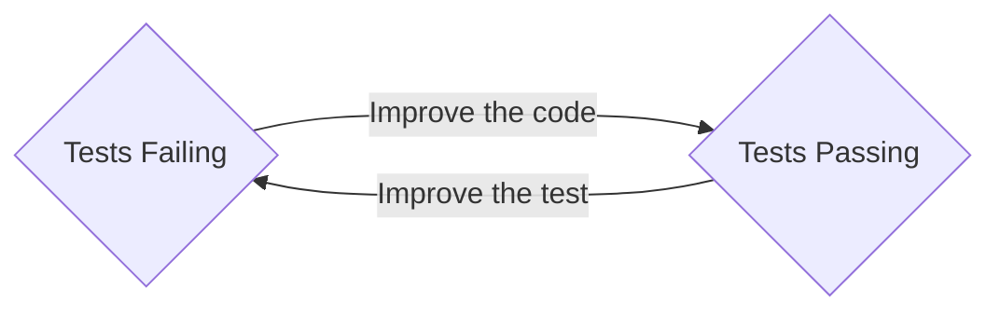
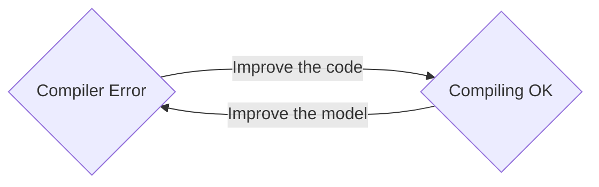

---
audience:
---
<style>
:root {--r-code-font: "FiraCode Nerd Font";}
.reveal .hljs {min-height: 50%;}
</style>
%%
f7f7f7 background slide colour
or maybe 191919

# Cargo.toml

```toml
[package]
name = "compiler-driven"
version = "0.1.0"
edition = "2021"

[build-dependencies]

[dev-dependencies]

[dependencies]
axum = "0.7.4"
serde = { version = "1.0", features = ["derive"] }
serde_json = "1.0.68"
tokio = { version = "1.0", features = ["full"] }
```

# Lint Tweaks

These lints make clippy less noisy when I'm building the video

```rust
#![allow(dead_code)]
#![allow(unused_variables)]
#![allow(clippy::items_after_statements)]
#![allow(clippy::no_effect)]
#![allow(unused_must_use)]
#![allow(clippy::must_use_candidate)]
#![allow(clippy::unused_self)]
```

# Imports

```rust
```

# Setup

```rust
fn main() {
	println!("Rust talk");
}

```

%%

![[rust-logo.png|200]]

- Higher-level than Go, Javascript, Java,
	- but as fast as C

- No runtime or garbage collector,
	- but thread and memory safety guaranteed

- Comprehensive type system (with monads!),
	- but friendliest tooling in the business
notes:

# CDD: Compiler-Driven Development in Rust

Hi friends my name is Tris and this is No Boilerplate, focusing on fast, technical videos.

Rust has many extremely impressive, seemingly even contradictory claims.

- High level lisp-style metaprogramming
	- AND as fast as low-level C
- A zero-cost hard-realtime language with no garbage collection overheads
	- AND perfect memory and thread safety
- A rich type system allowing modelling of data impossible in other popular languages
	- AND gorgeous helpful errors produced by the friendly compiler when your modelling is wrong

How does Rust do all this when most popular languages can't?

**Comprehensive understanding of your code at compile-time.**

---

# Developers Live at Compile time

notes:

Whatever language you code in:
Javascript, Python, Java, Go, even HTML and CSS (to a certain extent), we developers all live at compile time.

Sure, we test the code, either by running it interactively or automating that in our tests, but the time when our code is actually executing on the CPU plays a very small part of our day.

Most of our time is not spent writing or running code, but reading it - often trying to figure out strange runtime behaviour!

Rust's superpowers are the direct result of being a language where the compiler can reason about as much of the code as you can.

The compiler is your best friend, your wingmate, a friendly and infallible pair programmer, and this opens a way of programming that you might never have experienced before:

**"Compiler-Driven Development"**

---

![[cc-zero-2k.png|300]]

## Public Domain Videos

[https://github.com/0atman/noboilerplate/](https://github.com/0atman/noboilerplate/)

(for all [blue links]() read my scripts here ⬆)

notes:
My videos are dedicated to the public domain.

Everything you see here: script, links, and images are part of a markdown document available freely on GitHub at the above address.

---

# Part 1: TDD Recap

<i class="fas fa-quote-left fa-2x fa-pull-left"></i>
_"The first principle is that you must not fool yourself, and you are the easiest person to fool."_

#### &mdash; Richard Feynman

notes:
Compiler-Driven Development is like Test-Driven Development.

I love TDD, and if you've not tried it before, you will too, it's probably not what you think it is.

TDD is not really about testing, nor about writing all your tests ahead of time, it's not even really about correctness.

It's about _not fooling yourself_ because, as Feynman said, you are the easiest person to fool.

---

# When Am I Done?

<i class="fas fa-quote-left fa-2x fa-pull-left"></i>
_"Done is the engine of **more**."_

#### &mdash; The Cult of Done

notes:

TDD, for me, answers the question I care most about when writing a project - am I done yet?

I'm not coding indefinitely for fun, past 5pm I'm not even being paid to code, and I'm certainly not here for my health.

Quite the opposite, actually.

TDD cuts to the heart of this:

I want to know when I'm done at the earliest possible moment, so I can STOP, and get on with other things.

---

# 🔴 Red

# 🟢 Green

# 🟠 Refactor

notes:

The core application of TDD is to write a simple test before writing any other code, then watch it fail, to "go red", thus proving that your test suite works.
Then you write the minimum application code to make the test pass, making it green again.

You then refactor if needed and then improve the test, making it stricter or more precice than before, watch the test fail again, and make it pass by improving the code.

This constant tick-tocking between Red and Green states for your test keeps you honest, focussed, and engaged with the question we're all trying to answer:

> When Am I Done?

Here's at a tiny TDD example in Rust:

---

# RED

```rust
#[test]
fn test_my_divider() {
	assert_eq!(my_divider(10, 2), 5.0);
}
```

notes:

First we write a new test, covering the functionality we're about to write, a simple arithmetic dividing function that takes a numerator, denominator, and returns the result of dividing the two.

Writing the test first makes us think about the problem we are solving first, rather than the plumbing of how to solve it - an important top-down approach that can get lost in the weeds in typical programming.

---

# RED

```sql
 1  error[E0425]: cannot find function `my_divider` 
   --> src/main.rs:13:13
    |
 13 |     assert_eq!(my_divider(10, 2), 5.0);
    |                ^^^^^^^^^^ not found in this scope

 error: could not compile `compiler-driven` due
 to 1 previous error
```

notes:

Of course, this new test fails - it actually fails before even being run, because it's calling a function the compiler can't find: our as-yet unwritten function, `my_divider`.

We have successfully broken our test suite!

Thus proving to ourselves that the testing is doing what we want, let's make it pass:

---

# GREEN

```rust
pub fn my_divider(x: i32, y: i32) -> f32 {
	5.0
}
```

notes:
We write the simplest code that makes our new test pass, hardcoding, as I'm doing here, is not only acceptible but encouraged!
Your tests should not be fooled by hardcoded answers, should they?

---

# GREEN

```sql
   Compiling compiler-driven v0.1.0 
    Finished `test` profile target(s) in 0.84s
     Running unittests src/main.rs 

running 1 test
test test_my_divider ... ok

test result: ok. 1 passed; 0 failed; 0 ignored;
finished in 0.00s
```

---

- watch the new test pass
- improve the test so hardcoding doesn't cut it, and watch it fail
- improve the code to make it pass.

---



notes:

- [ ] obviously improve this mermaid diagram
If the tests are failing, improve the code, if the tests are passing, improve the tests!

---

# Quadratic Shoutout

---

# Part 2

### Compiler-Driven Development

<i class="fas fa-quote-left fa-2x fa-pull-left"></i>
_Show me your flowcharts and conceal your tables, and I shall continue to be mystified. Show me your tables, and I won't usually need your flowcharts; they'll be obvious._

&mdash; Fred Brooks, "The Mythical Man-Month"

notes:

Now that we've revised TDD, we can talk about CDD.

CDD operates on the same Red/Green/Refactor pattern as TDD, except you're not writing tests, you're writing code that the compiler is not satisfied with, and the ticktocking between Red and Green is the conversation between you and the compiler.

A simple example will clear this up:

---

## 🔴 RED

###### ~~means recording~~

```rust[]
fn count_words(input) {
	1
}
```

&nbsp;

#### Goal: Try to build something that compiles

notes:

- [ ] pin to RMR

let's say we want to write a function to count the number of words in a string, by simply splitting on spaces.

Just as in TDD, I recommend you start by hardcoding values just to get the compiler to compile.

The goal here is to go green, to compile. This psudocode does not get us there, but unlike in TDD, we don't just get an error, we get FIXES!

- [ ] remove line numbers from all error outputs

---

## 🔴 RED

```rust[]
fn count_words(input) {
	1
}
```

```js[7-10]
error: expected one of `:`, `@`, or `|`, found `)`
  --> src/main.rs:19:21
 |
 | fn count_words(input) {
 |                     ^ expected `:`, `@`, or `|`
 |
help: if this is a parameter name, give it a type
 |
 | fn count_words(input: TypeName) {
 |                     ++++++++++

```

notes:

---

## 🔴 RED

```rust[]
fn count_words(input: String) {
	1
}
```

```rust[6]
error[E0308]: mismatched types
  --> src/main.rs:20:2
 |
 | fn count_words(input: String) {
 |                              ^
help: try adding a return type: `-> `
 |     1
 |     ^ expected `()`, found integer
```

notes:

We're getting there, the previous syntax error is now a compiler error - we're writing valid Rust, but we're not modelling the types correctly.

---

## 🟢 GREEN

```rust[1]
fn count_words(input: String) -> usize {
	1
}
```

notes:

We did it! The first hardcoded version of our function now compiles, and if it compiles we know many things are proved in the entire codebase, thanks to the rich type system.

When you're writing Rust, you must get to a compiling state as soon as you can, until you do all bets are off:
- LSP may act strangely
- Clippy can't suggest advanced features to use, and
- CDD can't work

Breaking the code, getting to a RED state is an important transition. Don't stay there for very long, break up big new work features into atomic, compilable chunks, and iterate upwards from compiling states.

RIGHT: Let's keep going, I don't see any refactoring needed yet, so we'll skip that and go back to red.

How do we do that? Heres's the flowchart that you should tattoo inside your eyelids:

---



notes:

- [ ] obviously improve this mermaid diagram

Remember, just as in TDD where we'd get to green by improving the code, and we'd get to red by improving the test;

In CDD we get to green by improving the code, still, but to get to red we must improving our model in the type system.

Let's continue:

---

## 🔴 RED

```rust[2]
fn count_words(input: String) -> usize {
	input.split() //input.split(" ") //probably this?
}
```

```rust[6-7]
--> src/main.rs:20:8

     input.split()
           ^^^^^ an argument is missing

help: method defined here:
 pub fn split<'a, P: Pattern<'a>>(&'a self, pat: P) ...
        ^^^^^
help: provide the argument
```

_(error edited to fit)_

notes:

I've made what I think is a reasonable guess about the name of the method to split a string, and compiled again.
However, I've deliberately not added the string parameter that `split()` almost certainly wants.

I've done this to make sure we're not staying green.
Sure the compiler remaining happy is PROBABLY good, but you'll KNOW it, if it goes red then back to green again.
Same as in TDD.

So what does `split()` require? Most of us would guess, correctly, that it wants a string. But how would we confirm that? The method definition is a bit cryptic, referencing the `Pattern` trait, but not telling us the concrete types we can use.

In other languages you might reach for the documentation of `String::split()`, or use your IDE's autocomplete to get the same, perhaps google the error, or start hacking around.

You can do all these in Rust, but we can also get the compiler to tell us exactly what it wants.

---

#### Bad merch available at <http://noboilerplate.org>

![[teepublic-obey-sticker.png|400]]

notes:
And you know what you have to do when the compiler tells you what it wants!

---

```rust[2]
fn count_words(input: String) -> usize {
	input.split(1)
}
```

```rust[7-14]
trait bound {integer}: Pattern<'_> is not satisfied
 |
 |     input.split(1)
 |           |
 |           required by this call
 |
 help: the following types implement trait Pattern<'a>
           &'b [char; N]
           &'b [char]
           &'b std::string::String
           &'b str
           &'c &'b str
           [char; N]
           char
```

notes:

To find out what type `String::split()` parameter accepts, introduce a type error deliberately. Splitting a string on a number doesn't make much sense, and the compiler knows it.
Here's the error when you do.

The full error was much larger than this, and a bit more scary, traits often are, but you don't have to understand it if you are at the start of your rust journey, or using a complex unfamiliar api, you just look at the wonderful help text the compiler has given us, enumerating all the concrete typos that implement the `Pattern` trait - the exact list that we want!

Unsuprisingly, it's all strings and character-related types.
Now, let's try it:

---

## 🔴 RED

```rust[]2
fn count_words(input: String) -> usize {
	input.split(" ")
}
```

```rust[]
error[E0308]: mismatched types
  --> src/main.rs:20:2
   |
19 | fn count_words(input: String) -> usize {
   |                                  ----- expected `usize` because of return type
20 |     input.split(" ")
   |     ^^^^^^^^^^^^^^^^ expected `usize`, found `Split<'_, &str>`
   |
   = note expected type `usize`
            found struct `std::str::Split<'_, &str>`

```

notes:

ah, another error, but the final one for this example.

Rust, like recent versions of python and many other languages, is built on iterators.

The return value of the `.split()` method isn't a static array or a list, it is an iterator, with all of the mapping, filtering, and other iterator methods available on it.

For the sake of time, I happen to know you can simply count the number of items in an iterator with `.count()`, and we will make our example go green by supplying it

---

# Final version

```rust
fn count_words(input: String) -> usize {
	input.split(" ").count()
}
```

notes:

The compiler is happy, and if the compiler is happy, I am happy.

But there's a cherry on top of CDD, in Rust.
The Compiler statically analysing our code is all very well, but that's not the only compile-time analysis we can do.

Let's set clippy on our code.

---


###### `$ cargo clippy -- -D clippy::pedantic -W clippy::nursery`

```rust[]
error: this argument is passed by value,
but not consumed in the function body
  --> src/main.rs:19:23
   |
19 | fn count_words(input: String) -> usize {
   |                       ^^^^^^
   |      help: consider changing the type to: `&str`
   |
```

```rust[]
error: single-character string constant used as pattern
  --> src/main.rs:20:14
   |
20 |     input.split(" ").count()
   |                 ^^^
   |               help: consider using a `char`: `' '`
```

notes:
See my other videos or the markdown script for this one, for my recommended ways to set up clippy.
Here, we're using the huge lint groups, `pedantic` and `nursery` to get HUGE insights into our code.
As the names suggest they are annoying and pre-release, respectively, but I love them both!

Clippy has told us, quite rightly that it would be more flexible to use a string slice, not a string, and that if we're using a single space character as a pattern for splitting, we should use single quotes to make it a character literal, not a string of length 1.

I literally learned the second optimisation while I was writing this video - clippy has singlehandedly taught me more rust than any book. Run it in a terminal with the `bacon` test runner whenever you write Rust!

---

# END

---

- [ ] Old part 2:

# Part 2: The Rich Type System

<i class="fas fa-quote-left fa-2x fa-pull-left"></i>
Show me your flowcharts and conceal your tables, and I shall continue to be mystified. Show me your tables, and I won't usually need your flowcharts; they'll be obvious.

&mdash; Fred Brooks, "The Mythical Man-Month"

notes:

Just as good data design can make runtime errors impossible, good program design in Rust can extend that

==4:20==

---

## No documentation thanks

# I'm a rustacean

notes:

I'll talk about some patterns to model enormous parts of your code later on, but first, let's see what compiler-driven development can do for us.

We'll start by making it much less necessary to read human-readable documentation.

Self-documenting code is a joke in other languages, it's a reality in Rust:

---

![[axum-readme-github.png]]

<https://github.com/tokio-rs/axum>

notes:

This is the readme of Axum, the most popular Rust web framework, with 3.4M downloads a month.

Reading documentation is for nerds and principle engineers, we're going to reproduce the example in the read me and start hacking, using only the rust compiler, no LSP tricks here.

---

%%

axum boilerplate:

```rust[]
use axum::{
    routing::{get, post},
    http::StatusCode,
    Json, Router,
};
use serde::{Deserialize, Serialize};
use tokio::net::TcpListener;
```

%%

```rust[]
#[tokio::main]
async fn axum_server() {
    let app = Router::new()
        .route("/",      get(root))
		.route("/users", post(create_user));
		
	let listener = TcpListener::bind("0.0.0.0:8080")
		.await.unwrap();
		
    axum::serve(listener, app).await.unwrap();
}
```

%%

```rust[]
println!("serving...");
axum_server();
```

%%

notes:

Here's the main function. It creates two routes, and serves them on port 8080.
Simple enough, but what are those two routes?

---

```rust[]
async fn root() -> &'static str {
    "Hello, World!"
}
```

```shell[]
$ curl localhost:8080
Hello, World!
```

notes:
The first one serves a simple static string. OK great.

---

```rust[]
async fn create_user(Json(payload): Json<CreateUser>) 
    -> (StatusCode, Json<User>) {
    
    let user = User {
        id: 1337,
        username: payload.username,
    };

    (StatusCode::CREATED, Json(user))
}
```

notes:

The second is more interesting, a post handler creating a user from a validated payload of json, and returning the new user as json.
BOTH input and ouput of this handler are documented and their enforced by the type signature.

OK, let's break this, what status codes have we got?

---

![[40-clippy-no-item-destroyed.png]]

notes:

Looks like there's an opening for a new status code.

Now this is interesting. Instead of giving us some options of what valid codes are available, which it would if we'd mispelled one

---

## LIVE Block

```rust[]
async fn create_user(Json(payload): Json<CreateUser>) 
    -> (StatusCode, Json<User>) {
    
    let user = User {
        id: 1337,
        username: payload.username,
    };

    (StatusCode::DELETED, Json(user))
}
```

---

```rust[9]
async fn test1(Json(payload): Json<CreateUser>) 
    -> (StatusCode, Json<User>) {
    
    let user = User {
        id: 1337,
        username: payload.username,
    };

    (StatusCode::from_u16(201).unwrap(), Json(user))
}
```

---

```rust[]
#[derive(Deserialize)]
struct CreateUser {
    username: String,
}
#[derive(Serialize)]
struct User {
    id: u64,
    username: String,
}
```

notes:

# Axum demo

---

```rust
enum FlightState {
	Boarding,
	Taxiing,
	Takeoff,
	Cruising,
	Landing,
	Deboarding,
} 
```

```rust
fn takeoff(flight: FlightState) -> FlightState {
	match flight {
		FlightState::Taxiing => FlightState::Takeoff,
		_ => flight
	}
}
```

---

# Rust is the opposite of Perl. Perl Makes Easy Things Easy and Hard Things Possible, Rust Makes Easy Things Possible and Hard Things Easy

<https://devclass.com/2023/03/20/microsofts-visual-basic-why-it-won-and-why-it-had-to-die/>

<https://www.amazon.com/Learning-Perl-Making-Things-Possible/dp/1491954329>

_You know how it's hard to learn something you can't see the point of?

I think this is why senior developers, particularly, flock to Rust.
We've been in the trenches, we've been paged at 4am, we've debugged the same missing semicolon or bad indentation errors a thousand times.

You tell me that with just a bit more syntax, Rust can fix my PTSD? I say SIGN ME UP!  

A junior developer, the sweet summer child, only wants things to be easy NOW.

Rust isn't optimised for easy NOW.
It's optimised for easy FOREVER."_

---

# Compiler-Driven Development

notes:

how to start with CDD in Rust is the same as with TDD, test driven development, but the tests are already written for you.

Red.
Green.
Refactor.
- [ ] check these colours.

- [ ] debugging steps
    - [ ] is the signature correct
    - [ ] make it compile with dummy body
    - [ ] break it
    - [ ] red/green/refactor
    - [ ] do a commit when the build succeeds - automate this

---

- Write a some basic tests for the new feature. This upfront testing requires you to focus on test requirements before starting hacking
- Add one test from the list
- Run all tests, watch the new test fail
- write the simplest code that makes the new code pass
	- hardcoding acceptible
- watch the new test pass
- improve the test so hardcoding doesn't cut it, and watch it fail
- improve the code to make it pass.

---

Autocomitting on `cargo build` ok

---

# Amortized Complexity

 - first run slow, subsequent runs fast
 - like rust compile times
 - like life

---
"Writing a compiler that would accept all of the valid programs is not possible, thus we're left with the next best thing: a compiler that will reject all invalid programs at a cost of being overly strict."
- [ ] who said this?

Rust forces you to fix all your future bugs before you deploy. This causes the steeper learning curve, but given that all future bugs are crammed into the first compile, it's a suprisingly flat curve!

---

# Optimise for Readability

notes:
As you know, languages are read far more often than they are written.
But there's another part to the story here.
Your programs, if you're lucky and doing your job right, will be used by orders of magnatude more people than those who read the code.
So it follows that some small sacrifice of readability is valid, if it benefits you.

---

# Parse Dont Validate

<https://lexi-lambda.github.io/blog/2019/11/05/parse-don-t-validate/>

is this the same as [[The Typestate Pattern in Rust]]

---

# Typestate Pattern

## States

```rust[]
struct Light<State> {
    state: State,
}

#[derive(PartialEq)]
struct On {}


#[derive(PartialEq)]
struct Off {}

```

## Transitions

```rust[]
impl Light<Off> {
    fn turn_on(self) -> Light<On> {
        Light {
            state: On {},
        }
    }
}
impl Light<On> {
    fn turn_off(self) -> Light<Off> {
        Light {
            state: Off {},
        }
    }
}
impl<State: PartialEq> Light<State> {
    fn flip<T>(self) -> Light<T> {
        if self.state == (On {}) {
	        Light { state: Off {} }
        } else {
	        Light { state: On {} }
        }
    }
}
```

---

## Correct Transitions

```rust[]
fn correct_transitions() {
	let bedroom_light = Light {
		state: Off {},
	};
	bedroom_light.turn_on().turn_off().turn_on();
}
```

---

## Incorrect Transitions

```rust[2]
let bedroom_light = Light { state: Off {} };
bedroom_light.turn_on().turn_on(); // can't call twice 
```

```sql
error[E0599]: no method named `turn_on` found 
for struct `Light<On>` in the current scope
   |
9  | struct Light<State> {
   | ------------------- method `turn_on` not found
...
41 |     start_state.turn_on().turn_on();
   |     -----------           ^^^^^^^
   |     |
   |     method `turn_on` is available on Light<Off>
```

notes:

- [ ] replace this with a screenshot of the error
---

# Typestate Pattern With Traits

## States

```rust[]
fn correct_transitions() {
    let bedroom_light = Light {
        state: Off
    };
    bedroom_light.turn_on().turn_off().turn_on();
}

// Primary stuct
struct Light<State: ResponseState> {
    state: State,
}


// States
struct On;
struct Off;


// Trait wiring for Start and Headers,
trait ResponseState {}
impl ResponseState for On {}
impl ResponseState for Off{}

```

## Transitions

```rust[]

// Methods availabe only in the Start state
impl Light<Off> {
    fn turn_on(self) -> Light<On> {
        Light { state: On }
    }
}

// Methods availabe only in the Headers state
impl Light<On> {
    fn turn_off(&self) -> Light<Off> {
        Light { state: Off }
    }
}


//impl<T, S> Transformable<T, S> for SomeStruct<T> {
//    type Output = SomeStruct<S>;

//impl<State: PartialEq> Light<State> {
//    fn flip<T>(self) -> Light<T> {
// Methods availabe in any state
impl<State: ResponseState> Light<State> {

    fn transition() -> Light<State> {
        Light {
            state: State
        }
    }

    /*
    pub fn tst(self) -> Light<On> {
        Light::transition()
    }
    */

/*
    fn flip(self) -> Self {
	    match self {
			Light { state: (On {}) } => Light { state: (Off {}) }
	    }
    }
*/


}
```

---

# Auto-commit Passing Builds

> If debugging is the process of removing software bugs, then programming must be the process of putting them in.

&mdash; Dijkstra

notes:
the commit message is

> Fixes [previous error]

---

# Designing at Compile Time

build a whole system with just they type system

show how prototyping at compile time can give real predictions
maybe use dependent types, or at least fake dependent types with custom new()

---

![[tri-hex-moon-white-transparent.png|300]]

# Thank You

## [Patreon.com/NoBoilerplate](http://www.patreon.com/noboilerplate)

notes:

# OUTRO

If you would like to support my channel, get early ad-free and tracking-free videos, vip discord access or 1:1 mentoring, head to patreon.com/noboilerplate.

If you're interested in transhumanism and hopepunk stories, please check out my weekly sci-fi podcast, Lost Terminal.

Or if urban fantasy is more your bag, do listen to a strange and beautiful podcast I produce every full moon called Modem Prometheus.

Transcripts and compile-checked markdown sourcecode are available on github, links in the description, and corrections are in the pinned ERRATA comment.

Thank you so much for watching, talk to you on Discord.
