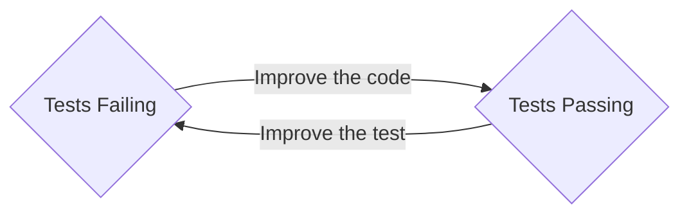

---
audience:
---
<style>
:root {--r-code-font: "FiraCode Nerd Font";}
.reveal .hljs {min-height: 50%;}
</style>
%%
f7f7f7 background slide colour
or maybe 191919

# Cargo.toml

```toml
[package]
name = "compiler-driven"
version = "0.1.0"
edition = "2021"

[build-dependencies]

[dev-dependencies]

[dependencies]
```

# Lint Tweaks

These lints make clippy less noisy when I'm building the video

```rust
#![allow(dead_code)]
#![allow(unused_variables)]
#![allow(clippy::items_after_statements)]
#![allow(clippy::no_effect)]
#![allow(unused_must_use)]
#![allow(clippy::unused_self)]
```

# Imports

```rust
```

# Setup

```rust
fn main() {
	println!("Rust talk");
	}

```

%%

![[rust-logo.png|200]]

- Higher-level than Go, Javascript, Java,
	- but as fast as C

- No runtime or garbage collector,
	- but thread and memory safety guaranteed

- Comprehensive type system (with monads!),
	- but friendliest compiler errors in the business
notes:

# CDD: Compiler-Driven Development in Rust

Hi friends my name is Tris and this is No Boilerplate, focusing on fast, technical videos.

Rust has many extremely impressive, seemingly even contradictory claims.

- High level lisp-style metaprogramming AND as fast as low-level C
- A zero-cost hard-realtime language with no garbage collection overheads, but with perfect memory and thread safety.
- Extremely rich type system allowing modelling of data impossible in other popular languages AND gorgeous helpful errors when your modelling is wrong

How can Rust do all these and other languages can't?

**Comprehensive understanding of your code at compile-time.**

---

# Developers Live at Compile time

notes:

Whatever language you code in:
Javascript, Python, Java, Go, even HTML and CSS, to a certain extent, we developers live at compile time.

Sure, we test the code, either by running it interactively or automating that in our tests, but the time when our code is actually executing on the CPU plays a very small part of our day.

Most of our time is not spent writing or running code, but reading it.

Rust's superpowers are the direct result of a language where the compiler can reason about as much of the code as you can.

The compiler is your best friend, your wingmate, a friendly and infallible pair programmer, and this opens ways of programming that you've never experienced before.

If you know how to use it.

---

![[cc-logo.png]]

## Public Domain Videos

[https://github.com/0atman/noboilerplate/](https://github.com/0atman/noboilerplate/)

(for all [links]() read my scripts here ⬆)

notes:
Everything you see in this video: script, links, and images are part of a markdown document available freely on GitHub under a public domain licence.

---

# Part 1: TDD Recap

<i class="fas fa-quote-left fa-2x fa-pull-left"></i>
_"The first principle is that you must not fool yourself, and you are the easiest person to fool."_

#### &mdash; Richard Feynman

notes:

I love Test-driven development, and if you've not tried it before, you will too.

TDD is not really about testing, nor about writing all your tests ahead of time, it's not even really about correctness.
It's about _not fooling yourself_, because, as Feynman said, you are the easiest person to fool.

---

# When Am I Done?

<i class="fas fa-quote-left fa-2x fa-pull-left"></i>
_"Done is the engine of more."_

#### &mdash; The Cult of Done

notes:

TDD, for me, answers the question I care most about when writing a project - am I done yet?

I'm not coding infinitely for fun, past 5pm I'm not even being paid to code, and I'm certainly not here for my health.
Quite the opposite, actually.

I want to know when I'm done at the earliest possible moment, so I can STOP, and get on with other things.

---

# Red
# Green
# Refactor

notes:

The core of TDD's application is that you write a simple test first, then watch it fail, to "go red", thus proving that your test suite works.
Then you write the minimum application code to make the test pass, making it green again.

You then refactor if needed and then improve the test, making it stricter or more precice than before, watch the test fail again, and make it pass by improving the code.

This constant tick-tocking between Red and Green states for your test keeps you honest, focussed, and engaged with the question we're all trying to answer:

When Am I Done!

Let's look at a tiny TDD example in Rust:


---

# RED

```rust
#[test]
fn test_my_divider() {
	assert_eq!(my_divider(10, 2), 5.0);
}
```

notes:

first we write a new test, covering the functionality we're about to write, a simple arithmetic dividing function that takes a numerator, denominator, and returns the result of divding the two.

Writing the test first makes us think about the problem we are solving first, rather than the plumbing of how to solve it - an important top-down approach that can get lost in the weeds in typical programming.

---

# RED

```sql
 1  error[E0425]: cannot find function `my_divider` 
   --> src/main.rs:13:13
    |
 13 |     assert_eq!(my_divider(10, 2), 5.0);
    |                ^^^^^^^^^^ not found in this scope

 error: could not compile `compiler-driven` due
 to 1 previous error
```
notes:

Of course, this new test fails - it actually fails before even being run, because it's calling a function the compiler can't find: our as-yet unwritten function, my_divider.

We have successfully broken our test suite! 

Thus proving to ourselves that the testing is doing what we want, let's make it pass:

---

# GREEN

```rust
pub fn my_divider(x: i32, y: i32) -> f32 {
	5.0
}
```

notes:
We write the simplest code that makes our new test pass, hardcoding, as I'm doing here, is not only acceptible but encouraged!
Your tests should not be fooled by hardcoded answers, should they?


---

# GREEN

```sql
   Compiling compiler-driven v0.1.0 
    Finished `test` profile target(s) in 0.84s
     Running unittests src/main.rs 

running 1 test
test test_my_divider ... ok

test result: ok. 1 passed; 0 failed; 0 ignored;
finished in 0.00s
```
---

- watch the new test pass
- improve the test so hardcoding doesn't cut it, and watch it fail
- improve the code to make it pass.

---



notes:

If the tests are failing, improve the code, if the tests are passing, improve the tests!

---

# Patreon-only addition

- [ ] a bridge between CDD and TDD is const-driven testing.

---

# Part 2: The Rich Type System

<i class="fas fa-quote-left fa-2x fa-pull-left"></i>
Show me your flowcharts and conceal your tables, and I shall continue to be mystified. Show me your tables, and I won't usually need your flowcharts; they'll be obvious.

&mdash; Fred Brooks, "The Mythical Man-Month"

notes:

Just as good data design can make runtime errors impossible, good program design in Rust can extend that

---

# Rust is the opposite of Perl. Perl Makes Easy Things Easy and Hard Things Possible, Rust Makes Easy Things Possible and Hard Things Easy

https://devclass.com/2023/03/20/microsofts-visual-basic-why-it-won-and-why-it-had-to-die/

https://www.amazon.com/Learning-Perl-Making-Things-Possible/dp/1491954329

_You know how it's hard to learn something you can't see the point of?

I think this is why senior developers, particularly, flock to Rust.
We've been in the trenches, we've been paged at 4am, we've debugged the same missing semicolon or bad indentation errors a thousand times.

You tell me that with just a bit more syntax, Rust can fix my PTSD? I say SIGN ME UP!  

A junior developer, the sweet summer child, only wants things to be easy NOW.

Rust isn't optimised for easy NOW.
It's optimised for easy FOREVER."_

---

# Compiler-Driven Development

notes:

how to start with CDD in Rust is the same as with TDD, test driven development, but the tests are already written for you.

Red.
Green.
Refactor.
- [ ] check these colours.

- [ ] debugging steps
    - [ ] is the signature correct
    - [ ] make it compile with dummy body
    - [ ] break it
    - [ ] red/green/refactor
    - [ ] do a commit when the build succeeds - automate this

---

- Write a some basic tests for the new feature. This upfront testing requires you to focus on test requirements before starting hacking
- Add one test from the list
- Run all tests, watch the new test fail
- write the simplest code that makes the new code pass
	- hardcoding acceptible
- watch the new test pass
- improve the test so hardcoding doesn't cut it, and watch it fail
- improve the code to make it pass.

---

Autocomitting on `cargo build` ok

---

# Amortized Complexity

 - first run slow, subsequent runs fast
 - like rust compile times
 - like life

---
"Writing a compiler that would accept all of the valid programs is not possible, thus we're left with the next best thing: a compiler that will reject all invalid programs at a cost of being overly strict."
- [ ] who said this?

Rust forces you to fix all your future bugs before you deploy. This causes the steeper learning curve, but given that all future bugs are crammed into the first compile, it's a suprisingly flat curve!

---

# Optimise for Readability

notes:
As you know, languages are read far more often than they are written.
But there's another part to the story here.
Your programs, if you're lucky and doing your job right, will be used by orders of magnatude more people than those who read the code.
So it follows that some small sacrifice of readability is valid, if it benefits you.

---

# Parse Dont Validate

https://lexi-lambda.github.io/blog/2019/11/05/parse-don-t-validate/

is this the same as [[The Typestate Pattern in Rust]]

---

# Typestate Pattern

## States

```rust[]
struct Light<State> {
    state: State,
}

#[derive(PartialEq)]
struct On {}


#[derive(PartialEq)]
struct Off {}

```

## Transitions

```rust[]
impl Light<Off> {
    fn turn_on(self) -> Light<On> {
        Light {
            state: On {},
        }
    }
}
impl Light<On> {
    fn turn_off(self) -> Light<Off> {
        Light {
            state: Off {},
        }
    }
}
impl<State: PartialEq> Light<State> {
    fn flip<T>(self) -> Light<T> {
        if self.state == (On {}) {
	        Light { state: Off {} }
        } else {
	        Light { state: On {} }
        }
    }
}
```

---

## Correct Transitions

```rust[]
fn correct_transitions() {
	let bedroom_light = Light {
		state: Off {},
	};
	bedroom_light.turn_on().turn_off().turn_on();
}
```

---

## Incorrect Transitions

```rust[2]
let bedroom_light = Light { state: Off {} };
bedroom_light.turn_on().turn_on(); // can't call twice 
```

```sql
error[E0599]: no method named `turn_on` found 
for struct `Light<On>` in the current scope
   |
9  | struct Light<State> {
   | ------------------- method `turn_on` not found
...
41 |     start_state.turn_on().turn_on();
   |     -----------           ^^^^^^^
   |     |
   |     method `turn_on` is available on Light<Off>
```

notes:

- [ ] replace this with a screenshot of the error
---

# Typestate Pattern With Traits

## States

```rust[]
fn correct_transitions() {
    let bedroom_light = Light {
        state: Off
    };
    bedroom_light.turn_on().turn_off().turn_on();
}

// Primary stuct
struct Light<State: ResponseState> {
    state: State,
}


// States
struct On;
struct Off;


// Trait wiring for Start and Headers,
trait ResponseState {}
impl ResponseState for On {}
impl ResponseState for Off{}

```

## Transitions

```rust[]

// Methods availabe only in the Start state
impl Light<Off> {
    fn turn_on(self) -> Light<On> {
        Light { state: On }
    }
}

// Methods availabe only in the Headers state
impl Light<On> {
    fn turn_off(&self) -> Light<Off> {
        Light { state: Off }
    }
}


//impl<T, S> Transformable<T, S> for SomeStruct<T> {
//    type Output = SomeStruct<S>;

//impl<State: PartialEq> Light<State> {
//    fn flip<T>(self) -> Light<T> {
// Methods availabe in any state
impl<State: ResponseState> Light<State> {

    fn transition() -> Light<State> {
        Light {
            state: State
        }
    }

    /*
    pub fn tst(self) -> Light<On> {
        Light::transition()
    }
    */

/*
    fn flip(self) -> Self {
	    match self {
			Light { state: (On {}) } => Light { state: (Off {}) }
	    }
    }
*/


}
```

---

# Auto-commit Passing Builds

> If debugging is the process of removing software bugs, then programming must be the process of putting them in.

&mdash; Dijkstra

notes:
the commit message is

> Fixes [previous error]

---

# Designing at Compile Time

build a whole system with just they type system

show how prototyping at compile time can give real predictions
maybe use dependent types, or at least fake dependent types with custom new()

---

![[tri-hex-moon-white-transparent.png|300]]

# Thank You

## [Patreon.com/NoBoilerplate](http://www.patreon.com/noboilerplate)

notes:

# OUTRO

If you would like to support my channel, get early ad-free and tracking-free videos, vip discord access or 1:1 mentoring, head to patreon.com/noboilerplate.

If you're interested in transhumanism and hopepunk stories, please check out my weekly sci-fi podcast, Lost Terminal.

Or if urban fantasy is more your bag, do listen to a strange and beautiful podcast I produce every full moon called Modem Prometheus.

Transcripts and compile-checked markdown sourcecode are available on github, links in the description, and corrections are in the pinned ERRATA comment.

Thank you so much for watching, talk to you on Discord.
