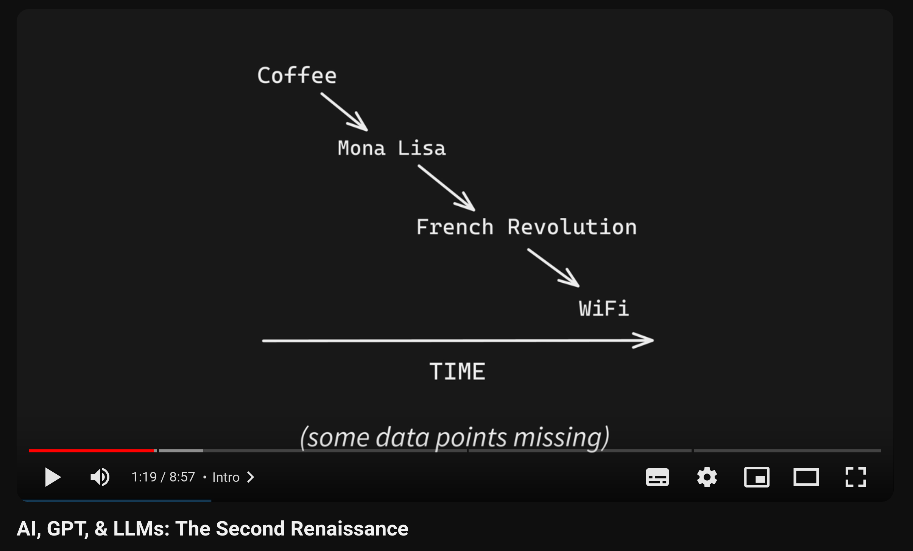

notes:
Hi friends, my name is Tris and this is No Boilerplate, focusing on fast, technical videos.

Today I'd like to introduce you to a small project I've recently published.
This "Brainmade" Mark, here, is something I will be attaching to any works of mine that were mostly made by me or my friends, not by generative AI tools like GPT.

I've built a small website at <http://brainmade.org> with high-resolution black or white versions of the logo available for download and attaching to your own projects if you'd like to.

I want to be clear today about my reasoning for building this:

---

# I Don't Hate AIs

# I Love Humans

notes:

**I don't hate AIs,**
**I love humans!**

---


## Public Domain Videos

[https://github.com/0atman/noboilerplate/](https://github.com/0atman/noboilerplate/)

(for all [blue links]() read my scripts here ⬆)

notes:
My video scripts are dedicated to the public domain.

Everything you see here: script, links, and images are part of a markdown document available freely on GitHub at the above address.

---



notes:

# Story Time

I've been thinking about this topic since my GPT & AI video, in 2023, where I described the current crop of Large Language Models as giving everyone "1000 interns".

> And just like interns, they are not always right, but they ARE enthusiastic and confident when delivering their work.

I don't hate AI-generated content, but it's kinda disappointing when you find out something cool was AI-made, right?

---


notes:

I saw this post from Bridget on mastodon last month, and I get the feeling that she and I would agree on this point:

Even if the artistic output looks/reads/sounds the same, there's something really... GOOD about knowing another **human** made it.
LLMs certainly have huge ethical concerns, but that's not the root problem for me, forever.

---

(Pause and read all this, this was ChatGPT YESTERDAY)


notes:

# Take Care

They also don't really work very well?

---

## We're Human, We're Family

<i class="fas fa-quote-left fa-2x fa-pull-left"></i>
_there is nothing in the most stygian depths of the darkest sea that is not our beloved brother compared to the horrors of the Abominations._

(This quote from [r/AskScienceFiction](https://www.reddit.com/r/AskScienceFiction/comments/1zwhxf/comment/cfxmqcz/) is about Cthulhu, but I think it's ALSO about AI art)

notes:

When (not if) ethical models are built, and powered by 100% solar power,
- I still want to hear your dumb-ass poems,
- read your embarrassing fanfic,
- and listen to your nasty beats.

---

# Prior Art

<split even gap="1">


</split>

[no-ai-icon.com](https://no-ai-icon.com) is close, but no thanks

notes:

Though these days I'm a video and audio producer, at heart I'm still a software developer:
I'll reuse 100 libraries to avoid writing 10 lines of code - standing on the shoulders of giants is the only way I know how I get around.

But I've looked for a way to mark my videos and stories as being made by humans, not AI, and I couldn't find one that worked in exactly the way I want.

I have many issues with the options I've seen so far, from having multiple logos (which is confusing) to the fixation on AI being inherently evil (this will simply not always be the case).
My root concern with these methods is that they are negative. `AI = bad`.
But I think the correct way to present this is `human = good`.

I don't need 100% human made (what would that even MEAN these days?), I perhaps need 90% human made. Three examples may make my thinking clearer:

---

## 1. ChatGPT dictionary

## 2. DALL-E brainstorming

## 3. LLAMA Vocabulary Boost

## 4. Github Copilot

notes:

- Using, say, chatgpt as a rhyming dictionary feels fine, but writing whole verses of your poem with it doesn't.
- Using DALL-E to start brainstorming 100 generated views of birds sitting on telephone lines seems fine, but getting it to paint large sections of your final artwork doesn't.
- and, asking a text generator to give you 10 happy-sounding synonyms for despair does spark joy in me, but asking it to write your anti-transcendentalist masterpiece does not.
- Using copilot to speed up programming low-value boilerplate code is of course fine -
	- This is simply advanced autocomplete, literally what this technology was made for

---

# 🎨 Creator

### or

# Curator 📁

notes:

Using these generative tools to make more of the artwork you want is valid, but in doing so, you've not become a creator, you've stepped into the role of curator, cataloguing artwork that you like the look of.

I'm not sure exactly what 'too much AI' is, but just like your audience, I'll know it when I see it.

I love knowing a human made the artwork I'm consuming.
There's *something* there, something transcendent and magical.

When you make something yourself, you learn something, and when I see what you've made, I'm inspired to learn it too!

I *like* that you tried hard, that's part of the experience.

---


[LostTerminal.com](http://LostTerminal.com)
notes:

I'm not a human supremacist, either!

I write about AIs, _REAL AIs_ (and, of course, by that, I mean _fictional_ AIs), aGis, every single day for my speculative sci-fi show, Lost Terminal.

When real artificial intelligence is created, I'll have to retire this mark!

In the timeline of my story, it happens in about 50 years, so we've all got a bit of time left.

---

<i class="fas fa-quote-left fa-2x fa-pull-left"></i>

### "Text-based Large Language Models are autocorrect trained on the entire internet, with enough complexity to pass the Turing test"

_&mdash; Me desperately explaining to the CEO why integrating "AI" into our project won't solve all our problems._

notes:

# LLMs Are a Great Human/Computer Interface

Text-based Large Language Models are autocorrect trained on the entire internet, with enough complexity to pass the Turing test.

Nothing more, nothing less.

That's pretty incredible! We've brute-forced natural language i/o in such a grand way that it's easy to misinterpret for ACTUAL intelligence.

Yes, there's some investor-baiting going on with using AI in places it doesn't belong, nonetheless there is plenty of utility in these methods, so it's foolish to demonise the technology itself.

I hope the Brainmade mark emphasises this goal.

---

## The Art Isn't the Art

### The Art is Never the Art

notes:
As I've said before on this channel.

> Smash the pots! Burn the paintings!
> The art isn't the art.
> The art is never the art.
> The art is the thing that happens inside you when you make it, and the feeling in the heart of the beholder.

- I LIKE writing my bad poetry, and I LIKE reading your great poetry and hearing how your life influenced it,
- I LIKE making my mediocre music, and I LIKE listening to your great music, and figuring how to imitate it and make my own cover versions,
- I didn't used like how my voice sounds on a recording, but with practice, and copying others, I do now!

---

## Good Artists Copy

## Great Artists Steal

notes:

Good artists copy, great artists steal.
I sure hope this is still true!

Don't let OpenAI steal the art for you:
Steal the damn work for yourself, and we'll all learn something.

---

# Thank You

Especially to my Producer and Sponsor patrons:

%%

```rust
fn credits() {
```

%%

```rust
let producers: [&str; 0] = [];
let sponsors = [
	"Jaycee", "Gregory Taylor", "Ything LLC",
	"Taylor Dolezal"
];
```

%%

```rust
}
```

%%

### [Patreon.com/NoBoilerplate](http://www.patreon.com/noboilerplate)

### [ko-fi.com/noboilerplate](https://ko-fi.com/noboilerplate)

notes:

# OUTRO

Thank you.

If you would like to support my channel, get early ad-free and tracking-free videos, your name in the credits or 1:1 mentoring, head to my patreon or ko-fi.

I've got a new fiction Podcast out called The Phosphene Catalogue, if you like mysteries and art, check it out!

If you're interested in transhumanism and hopepunk, please check out my weekly sci-fi audiofiction podcast, Lost Terminal.

Or if urban fantasy is more your bag, do listen to a strange and beautiful podcast I produce every full moon called Modem Prometheus.

Transcripts and compile-checked markdown sourcecode are available on github, links in the description, and corrections are in the pinned ERRATA comment.

Thank you so much for watching, talk to you on Discord.
