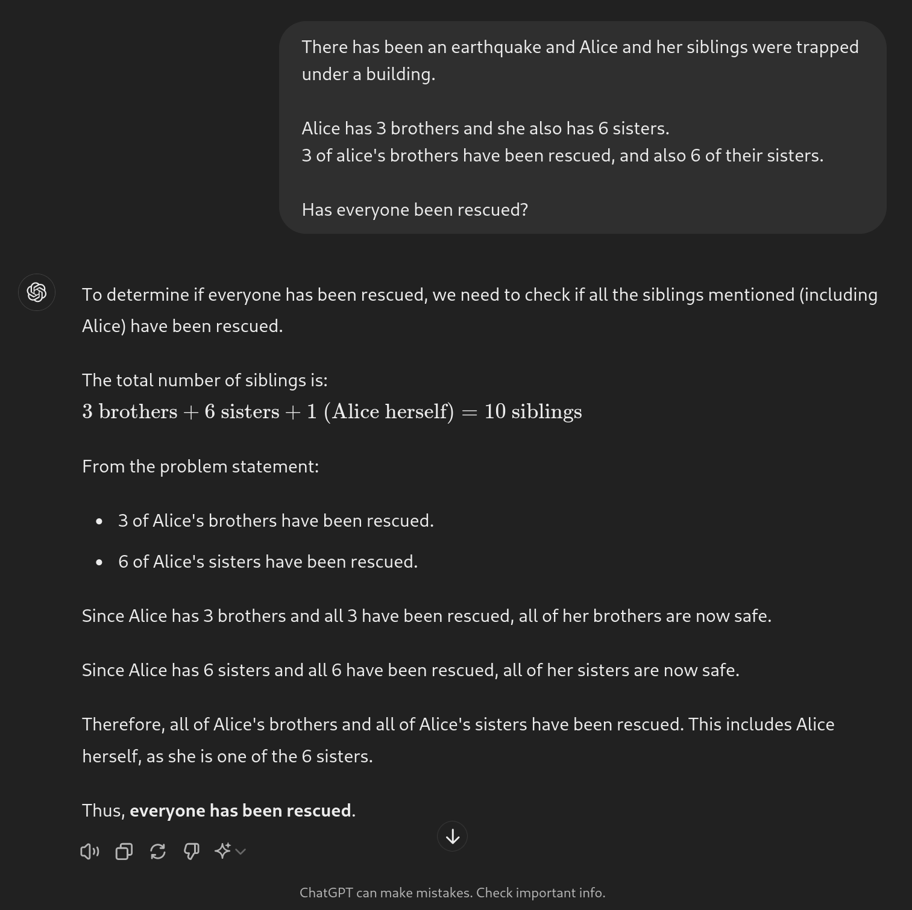

<style>
:root {--r-code-font: "FiraCode Nerd Font";}
.reveal .hljs {min-height: 50%;}
</style>


notes:
Hi friends my name is Tris and this is No Boilerplate, focusing on fast, technical videos.

Today I'd like to introduce you to a small project I've recently published.

This "Humanmade" mark is something I will be attaching to any works of mine that were mostly made by humans, not by AI tools like GPT.

I've built a small website at <http://humanmademark.com> with high-resolution black or white versions of the mark available there to download and attach to your own projects, if you would like to.

I want to be clear in this video about my reasoning for building this:
I don't hate AIs, I love humans.

---


## Public Domain Videos

[https://github.com/0atman/noboilerplate/](https://github.com/0atman/noboilerplate/)

(for all [blue links]() read my scripts here ⬆)

notes:
My video scripts are dedicated to the public domain.

Everything you see here: script, links, and images are part of a markdown document available freely on GitHub at the above address.

---

notes:

## Story Time

I've been thinking about this topic since my GPT & AI video, where I described the current crop of Large Language Models as "1000 interns"

I don't hate AI-generated content, but I am kinda disappointed when I find out something cool was ai generated.

---


notes:

The root of this is, as Bridget here pointed out on mastodon last month, because, even if the output looks/reads/sounds the same, there's something really nice about knowing another **human** made the artwork.

LLMs certainly have huge ethical concerns at the moment, but that's not the root problem for me, forever.

---

# We're Human,
# We're Family

notes:

When (not if) ethical models are built, and powered by 100% solar power, I still want to hear your dumb-ass poems, and listen to your nasty beats.

> there is nothing in the most stygian depths of the darkest sea that is not our beloved brother compared to the horrors of the Abominations.

https://www.reddit.com/r/AskScienceFiction/comments/1zwhxf/comment/cfxmqcz/

---

# Prior Art

<split even gap="1">


</split>

[no-ai-icon.com](https://no-ai-icon.com) is close, but no thanks

notes:

I'm a software developer, I'll re-use 100 libraries to avoid writing 10 lines of code - standing on the shoulders of giants is the only way I know how I get around.

But I've looked for a way to mark my work as being made by humans, not AI, and I can't find one that works in the way I want.

these icons are typical of the projects I've seen [https://no-ai-icon.com/](https://no-ai-icon.com/ "https://no-ai-icon.com/")

I don't want "NO AI USED", signposts that are negative and, judgemental, nor a 100% human made" guarantee - what does that even MEAN?

I want a positive mark.

There are lots of problems i have with the options I've seen so far, from having multiple marks (which is confusing) to the fixation on AI being inherently evil (this will not always be the case)

The root problem with these methods is they are negative.
"Ai=bad" . But the correct way to present this is "human=good" I love knowing a human made the artwork I'm consuming. There's something there, something trancendant and magical.

---

<i class="fas fa-quote-left fa-2x fa-pull-left"></i>
_If you didn't bother to make it, why should I bother to watch it?_

notes:

I _like_ that you tried hard, _that's part of the experience._

---


[LostTerminal.com](http://LostTerminal.com)
notes:

I'm not a human supremacist, either!

I write about AIs, REAL AIs (and by that I mean fictional AIs), AGIs, every single day for my speculative scifi show, Lost Terminal.

When real artificial intelligence are created, I'll have to retire my mark!

In the timeline of my story, it happens in about 50 years, so we've got a bit of time still.

---

# LLMs Are a Great Human/Computer Interface

notes:

Text-based Large Language Models are autocorrect enough complexity to pass the Turing test.
That's pretty incredible.
We've figured out natural language i/o in such a grand way that it's easy to misinterpret for actual intelligence.

Yes, there's some investor-baiting going on with using AI in places where it doesn't seem useful, but there is use in these models.

I don't want my doctor to be using

---



Oh no.

notes:
# Take care

---

## The Artwork is not the Art

### The Art is the Art

As I've said before on this channel.

Smash the pots! Burn the paintings!
The art isn't the art.
The art is never the art.
The art is the thing that happens inside you when you make it and the feeling in the heart of the beholder.
-- COD

- I LIKE writing my bad poetry, and I LIKE reading your great poetry and hearing how your life influenced it
- I LIKE making my mediocre music, and I LIKE listening to your great music, and figuring how to imitate it and make my own cover version
	- trying to figure out how you did it.
- I didn't like how my voice sounds, but with practice, and paying attention to where I can be better, I do now!

## Good Artists Copy, Great Artists Steal

### (I Sure Hope This is true!)

---

# Thank You

Especially to my Producer and Sponsor patrons:

%%

```rust
fn credits() {
```

%%

```rust
let producers: [&str; 0] = [];
let sponsors = [
	"Jaycee", "Gregory Taylor", "Ything LLC"
];
```

%%

```rust
}
```

%%

### [Patreon.com/NoBoilerplate](http://www.patreon.com/noboilerplate)

### [ko-fi.com/noboilerplate](https://ko-fi.com/noboilerplate)

notes:

# OUTRO

Thank you.

If you would like to support my channel, get early ad-free and tracking-free videos, your name in the credits or 1:1 mentoring, head to my patreon or ko-fi.

If you're interested in transhumanism and hopepunk, please check out my weekly sci-fi audiofiction podcast, Lost Terminal.

Or if urban fantasy is more your bag, do listen to a strange and beautiful podcast I produce every full moon called Modem Prometheus.

Transcripts and compile-checked markdown sourcecode are available on github, links in the description, and corrections are in the pinned ERRATA comment.

Thank you so much for watching, talk to you on Discord.
