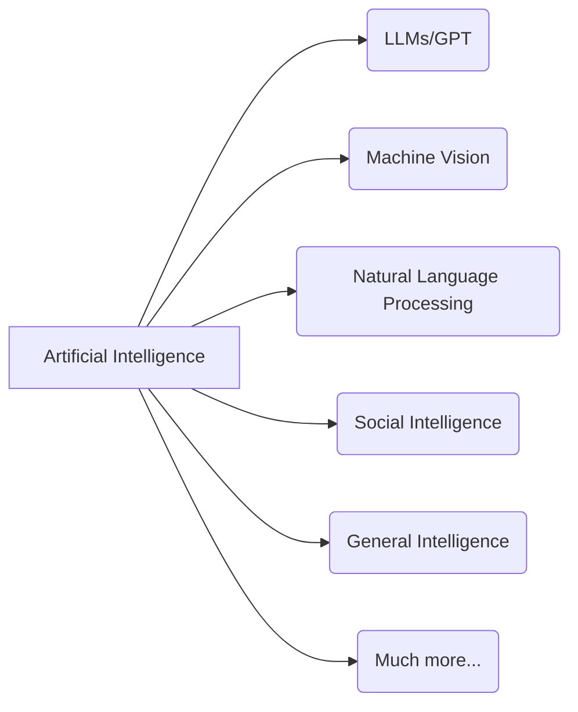

<style>
.reveal .mermaid svg {
  min-width: 100%;
  height: auto;
}
.reveal .mermaid svg .label-container {
  fill: var(--r-background-color) !important;
}
.reveal .mermaid svg .label foreignObject {
  overflow: visible !important;
}
.reveal .mermaid svg .nodeLabel {
  color: var(--r-main-color) !important;
}
.reveal .mermaid svg .edgePaths path {
  stroke: var(--r-main-color) !important;
}
.reveal .mermaid svg marker {
  stroke: var(--r-main-color) !important;
  fill: var(--r-main-color) !important;
}
.reveal .mermaid svg .edgeLabel {
  background-color: var(--r-background-color) !important;
  color: var(--r-main-color) !important;
  font-size: 13px;
}
</style>

<style>
:root {--r-code-font: "FiraCode Nerd Font";}
.reveal .hljs {min-height: 50%;}
</style>

![[attachments/tri-hex-moon-white-transparent.png|300]]
notes:

Hi friends, my name is Tris and this is No Boilerplate, where I make fast, technical videos.

Today, I'm going to explain my framework for thinking about AI tools, what they're great at, what they're not so good at, why they don't live up to their claims.
And what to do about that.

---


🙄

notes:

So, Apple Intelligence has been out for a couple of months now, but like a lot of AI promises, it's fallen a little short, right?

---


_Blade Runner_ (2017)

notes:

- The AI hype train is driven by the tantalising promise of AGI, general intelligence, like we see in the movies:
	- Maria, HAL, Marvin, Johnny Five, C-3PO, Rachel & Deckard, Holly, JARVIS, WALL-E
- But, despite 4 years of promises, Apple Intelligence is the latest example of these products missing the mark.

---


<i class="fas fa-quote-left fa-2x fa-pull-left"></i>
_"Almost useless."_ &mdash; [Marques Brownlee](https://www.youtube.com/watch?v=haDjmBT9tu4)

notes:

## Apple Intelligence

The best two things that Marques, here, has to say about Apple Intelligence are:
1. The background eraser tool is pretty good, and,
2. it has bumped up the base RAM across all of Apple's hardware line-up
    - This is well overdue, as I mentioned in my video on [[The Unreasonable Effectiveness of Linux Workstations]]

---

![[attachments/apple-stupid.jpg]]

<i class="fas fa-quote-left fa-2x fa-pull-left"></i>
_"You have to be an idiot to like Apple Intelligence."_ &mdash; ["CNET](https://www.youtube.com/watch?v=D0V554NyXWM)

notes:

# CNET

CNET did not hold back on their criticism either.

Apple Intelligence was announced at WWDC in June 2024, but didn't ship with the brand new iPhones and the other hardware that was announced then, and only after months were these strangely mediocre features released to us.

The _really good_ stuff is coming, we are promised.

And I believe we have heard that before.

---

![[attachments/cc-zero-2k.png|400]]

### Public Domain Videos

###### [https://github.com/0atman/noboilerplate/](https://github.com/0atman/noboilerplate/)

(for all [blue links]() read my scripts here ⬆)

%% look, if you've got a better way of doing this, I'd love to hear it! Please PR my default template :-) %%
&nbsp;&nbsp;&nbsp;&nbsp;&nbsp;&nbsp;&nbsp;&nbsp;&nbsp;&nbsp;&nbsp;&nbsp;&nbsp;&nbsp;&nbsp;&nbsp;&nbsp;&nbsp;&nbsp;&nbsp;&nbsp;&nbsp;&nbsp;&nbsp;&nbsp;&nbsp;&nbsp;&nbsp;&nbsp;&nbsp;&nbsp;&nbsp;&nbsp;&nbsp;&nbsp;&nbsp;&nbsp;&nbsp;&nbsp;&nbsp;&nbsp;&nbsp;&nbsp;&nbsp;&nbsp;&nbsp;&nbsp;&nbsp;&nbsp;&nbsp;&nbsp;&nbsp;&nbsp;&nbsp;&nbsp;&nbsp;&nbsp;&nbsp;&nbsp;&nbsp;&nbsp;&nbsp;&nbsp;&nbsp;&nbsp;&nbsp;&nbsp;&nbsp;&nbsp;&nbsp;&nbsp;&nbsp;&nbsp;&nbsp;&nbsp;&nbsp;&nbsp;&nbsp;&nbsp;&nbsp;&nbsp;&nbsp;&nbsp;&nbsp;&nbsp;&nbsp;&nbsp;&nbsp;&nbsp;&nbsp; ![[attachments/white-logo.svg|200]]

notes:
My video scripts are dedicated to the public domain.

Everything you see here: script, links, and images are part of a Markdown document available freely on GitHub at the above address.

---

<!-- slide bg="#101914" -->

# Part 1:

## Language is important



notes:

To understand what is happening with AI, let us tighten up our definitions, and give credit to what DOES work well.

Artificial Intelligence is a large discipline, containing many fields, with applications that are already so well-integrated with our tools that we forget about them:
- Searching our photos by the contents of the photo instead of filename or date is AI.
- near-perfect (at least in English) voice recognition is AI
- Generative fill for editing out unwanted parts of images is also AI

These features are all AI tools, but we don't typically call them that.

---

<!-- slide bg="#101914" -->

![[attachments/tim-minchin-storm.png|800]]

<i class="fas fa-quote-left fa-2x fa-pull-left"></i>
_"Do you know what they call alternative medicine that's been proved to work? Medicine."_
&nbsp; &nbsp; &nbsp; &nbsp; &nbsp; &nbsp; &nbsp; &nbsp; &nbsp; &nbsp; &nbsp; &nbsp; &mdash; Tim Minchin, ["Storm"](https://www.youtube.com/watch?v=KtYkyB35zkk)

notes:

# When it works, we stop calling it AI

Like when alternative medicine is proved to work, we call it medicine, when AI tech works, we stop calling it AI.
It fades into the background of our normal computing.

---

<!-- slide bg="#101914" -->

# 🤖

# GenAI, LLM, GPT

notes:

This Video is about Generative AI, Large Language Models, and GPT. The technologies that the companies promise much with, but deliver surprisingly little.

---

<!-- slide bg="#101914" -->

![[attachments/despair-synonyms.png]]
notes:

### synonyms for despair

Large language models like ChatGPT are GREAT at comprehending language.
For instance: I've never used such a great thesaurus, you can just describe the feeling you want to convey, and get 10 reasonable words or phrases back.

But start to use it for knowledge, not language, and you get in to trouble.

---

<!-- slide bg="#101914" -->
![[attachments/chatgpt-aerosmith-dream-on.png]]

(the instrument is a harpshichord, not a piano)

notes:

ChatGPT4 got this question partially wrong, and so did Claude, at time of writing.
Gemini got the right answer, a harpsichord, but did not also identify the second instrument, a Mellotron, which chatgpt did.

The more specific the answers you want, the less reliable LLMs are.

---

<!-- slide bg="#101914" -->
![[attachments/demon-cat.png|500]]

_"Adventure Time"_ S1E18

notes:

### approximate knowledge

It reminds me of the Demon Cat from Adventure Time, which has approximate knowledge of many things.
It's very confident, but often inaccurate.

---

<!-- slide bg="#101914" -->

## More specific, less useful

![[Excalidraw/gpt-accuracy-through-complexity.excalidraw.svg]]

notes:
This trend exists across all the GPT tools I have tested, from cloud providers such as OpenAI to running and tweaking my own local models with ollama.

But that's fine! There's SO much value on the left of this graph!
For initial research and shallow exploration, you can ABSOLUTELY use a GPT tool to quickly find areas you want to look into deeper for yourself.

However, there are real limits in these generative techniques that you come up against very soon after you start using them for complex work.

Lets talk about where these limits come from, and how to avoid them.

---

<!-- slide bg="[[attachments/tri-hex-moon-white-transparent.png]]" data-background-size="35%" data-background-opacity="0.1" -->

<br/>
![[patreon.png|200]]

## [Patreon.com/NoBoilerplate](http://www.patreon.com/noboilerplate)

notes:

It's just me running this channel, and I'm so grateful to everyone for supporting me on this wild adventure.

If you'd like to see and give feedback on my videos up to a week early, as well as get private discord access, and even your name in the credits, it would be very kind of you to check my Patreon.

I'm also offering a limited number of mentoring slots. If you'd like 1:1 tuition on personal organisation, Rust, creative production, web tech, or anything that I talk about in my videos, do sign up and let's chat!

---

<!-- slide bg="#1B1010" -->

# Part 2:

#### The Magic Beans don't Work

## Because they don't have to

notes:

---

<!-- slide bg="#1B1010" -->

## GPT IS <span>AUTOCORRECT Trained on the entire internet with enough complexity to pass the Turing test<!-- element style="color: grey;" --></span>

notes:
GPT is a marvel of natural language processing. Autocorrect that is trained on the whole internet can almost always offer sensible suggestions about what should come next in a sentence.

---

<!-- slide bg="#1B1010" -->
<!-- slide bg="[[attachments/jarjar-transparent.png]]" data-background-opacity="0.1" data-background-size="80%" -->

<i class="fas fa-quote-left fa-2x fa-pull-left"></i>
_**"The ability to speak does not make you intelligent."**_ &mdash; Qui-Gon Jinn, Episode 1

notes:

but Language ability, as we learned in Star Wars, does not equal Intelligence

---

<!-- slide bg="#1B1010" -->

`>` What apples grow in the UK? <span>The UK is home to a variety of apple types, many of which thrive in its temperate climate. Some apples are traditional...</span><!-- element style="color: grey;" -->

&mdash; ChatGPT, at time of recording

notes:

The problem is that we are extremely language-centric creatures, and we mistake language proficiency for intelligence, which causes us to misuse this technology.
Or for this technology to misuse us.

You're not chatting to an intelligent agent, it's autocompleting your questions, like a sociopath getting under your skin by saying what it thinks you want to hear.

---

<!-- slide bg="#1B1010" -->

## LLMs can't math

$$1+1=2$$

vs

$$2e^2+5j=0$$

notes:

Large Language Models can only learn topics where there is a large amount of language available to train them.

For example, the reason LLMs can't autocomplete maths is because, apart from trivial examples, the state space of all numbers is too great to expect much existing training data

Contrast how often `1+1=2` is written in textbooks, easy for ChatGPT to complete, with how often, say, `2e^2+5j=0` is.

One of these has a large amount of existing natural language data available for training, one does not.

---

<!-- slide bg="#1B1010" -->


ChatGPT can make mistakes.

notes:

## ChatGPT

This is why tools like ChatGPT seem good at first, when you ask it simple questions, but as you dig deeper, they fall apart and get increasingly inaccurate, or hit artificial guard rails and only provide surface level responses.

---

<!-- slide bg="#1B1010" -->

## LLMS CAN'T LEARN SPECIFICS

<split even>
![[attachments/matt-might-phd-infographic-elementary.png|300]]

&nbsp;

![[attachments/matt-might-phd-infographic-postgrad-research.png|300]]

&nbsp;

![[attachments/matt-might-phd-infographic-phd.png|300]]

</split>

School &nbsp; &nbsp; &nbsp; &nbsp; &nbsp; &nbsp; &nbsp; &nbsp; &nbsp; University &nbsp; &nbsp; &nbsp; &nbsp; &nbsp; &nbsp; &nbsp; &nbsp; &nbsp; &nbsp; Ph.D.

["The illustrated guide to a Ph.D."](https://matt.might.net/articles/phd-school-in-pictures/), Matt Might

notes:

It's not that the technology is new, and will eventually get better, it's that this incredible language ability CAN ONLY WORK after being trained on large amounts of data.

By definition, there might be only a single PhD written about a very niche topic.
So GPT will never learn that information, because a single PhD paper is not a large amount of language.

And if you don't have a large amount of language, you can't train a large language model.

AI companies can't fulfil their wild promises, so why do they make them?

---

<!-- slide bg="#151821" -->

# Part 3:

## We are not the audience

notes:

I was confused by the dissonance between the hype and reality, until I realised we're not the audience for all this breathless hype.

As I've shown, if you take the claims at face value, these technologies simply don't work.
And things that don't work can't solve problems.
And you can't sell someone something that doesn't solve their problem, not twice anyway.

So why do the companies keep making these promises?
~~(it's capitalism)~~

---

<!-- slide bg="#151821" -->

# CAPITALISM IS WORKING FINE

notes:
WELL:
- It's not demand from the customers
- Nor direction from their engineers,
- not even, really, by choices made by their CEOs.

It's because the real decision-makers in these companies are their wealthy investors.

- Broken or mediocre AI tools (that we all hate) have been crammed into everything we use - now even our notifications - because the companies have to impress investors with AI features, even if they don't work well.

---

<!-- slide bg="#151821" -->

## The Startup Runway

![[Excalidraw/startup runway.excalidraw.svg]]

notes:

- [ ] fix font

When you work in tech startups, as I have over the past 15 years, you get to know the startup runway very well.

I wasn't always, as a lowly engineer, privy to the actual amount of funding coming in and salaries going out each month, but we would all be able to feel when the end of the runway was in sight.

You can typically extend your runway in two main ways:
1. Selling products and services to users for money
2. Persuading investors to part with more of their money

Selling products is HARD! They have to work!

But selling a promise? That's EASY.

---

<!-- slide bg="#151821" -->

# Plus ça change?

_The more things change, the more they stay the same._

notes:

Plus ça change, perhaps? I'm not so sure, it feels different this time, with AI.

---

<!-- slide bg="#151821" -->

## We're bad at identifying confidence tricksters

![[attachments/shooting fish light.png|800]]

_Shooting Fish_ (1997)

notes:

- GenAI is this perfect tool for tricking investors out of their money because, often enough, the people asking for the money - and their customers - think it works too!
- LLMs are great at basic stuff, and in the past when a computer could automate basic tasks to a good degree, it only required time, improvements, and of course money, to perfect.
	- As an investor, surely you'd better get in on the ground floor of this marvellous new technology!
	- Just as you have before.

---

<!-- slide bg="#151821" -->

# Conclusion:

## I don't want things that only _SEEM_ like they work

notes:

Conclusion: From colonies on Mars to democratising money, it's always easier to promise a bright future than build a better present.

What I remind myself to do, whenever I see these bazaar products that no-one needs, is:
- to pay less attention to what these companies say their tech will do in the FUTURE, and far more to what they actually can do TODAY.

---

<!-- slide bg="[[attachments/tri-hex-moon-white-transparent.png]]" data-background-size="40%" data-background-opacity="0.1" -->

# Thank You

To all my patrons, you make this possible!

%%

```rust
fn credits() {
```

%%

```rust
let producers: [&str; 0] = [];
let sponsors = [
	"Jaycee", "Gregory Taylor", "Ything LLC"
];
let patrons: [&str; 478];
```

%%

```rust
}
```

%%

### [Patreon.com/NoBoilerplate](http://www.patreon.com/noboilerplate)

### [ko-fi.com/noboilerplate](https://ko-fi.com/noboilerplate)

notes:

# OUTRO

Thank you.

If you would like to support my channel, get early ad-free and tracking-free videos, your name in the credits or 1:1 mentoring, head to my patreon or ko-fi.

If you're interested in transhumanism and hopepunk, please check out my weekly sci-fi audiofiction podcast, Lost Terminal.

Season 2 of The Phosphene Catalogue is broadcasting now, if you like mysteries and art, check it out!

Transcripts and compile-checked markdown sourcecode are available on github, links in the description, and corrections are in the pinned ERRATA comment.

Thank you so much for watching, talk to you on Discord.

```rust
  println!("That's all folks!");
} 
```
