<style>
:root {--r-code-font: "FiraCode Nerd Font";}
.reveal .hljs {min-height: 50%;}
</style>
%%
f7f7f7 background slide colour
or maybe 191919
%%

#### Part 1

# ALL ABOARD THE GEAR TRAIN! 🚋

<sup>
(Calling at my bank account, my house, and eBay)
</sup>

notes:

Hi friends my name is Tris. Every day I write electronic music, fast technical videos, and produce podcasts all on linux on whatever hardware is within reach.

If there is one thing I do all day and every day, it's Write.

---


notes:

Ever since discovering The Hitchhiker's Guide to the Galaxy books as a boy, I have wanted to be a writer.

But It was not until 2020, listening to Joseph Fink and Jeffery Craner's podcast "Start With This" that I realised I didn't need to write a book, I could write a podcast.

I lasted 5 episodes of SWT before I had to stop listening and start writing the pilot of my first podcast, Lost Terminal!

---


#### <https://lostterminal.com>

notes:

I produced it in a fever dream over the course of a few evenings, got my partner to read the credits, and to promise that "Lost Terminal will return next week". After that public commitment, there was no going back. I'm writing season 17 now.

---

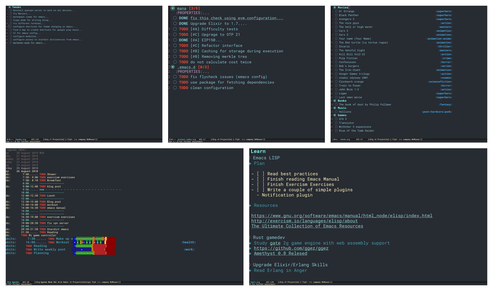

#### org-mode

notes:

I started out writing LT in Emacs' Org-Mode. A delightfully nerdy and powerful system for building a knowledge platform.
However, after a year, I discovered Obsidian, thanks to CGP Grey and Myke Hurley's productivity-focussed podcast, CORTEX.

---

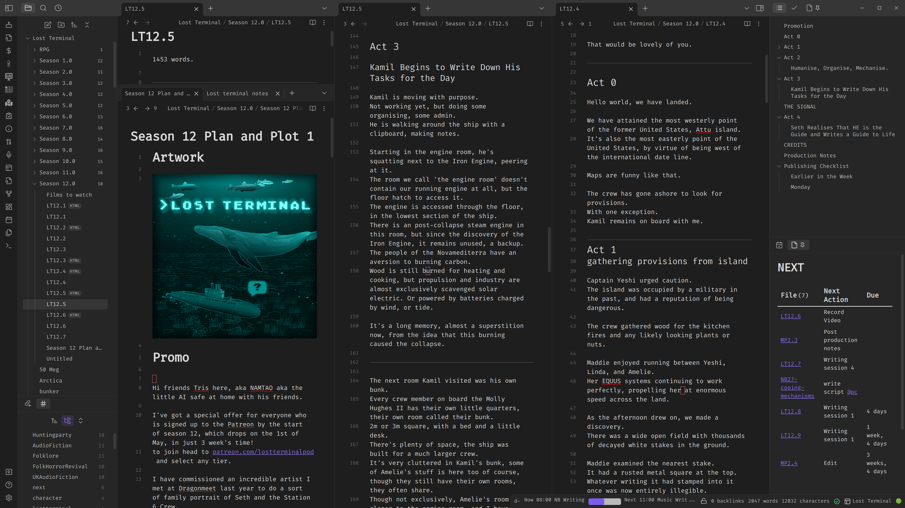

My video: [youtube.com/watch?v=DbsAQSIKQXk](https://www.youtube.com/watch?v=DbsAQSIKQXk) &nbsp;

notes:

Obsidian is a markdown-based note-taking / knowledge management / everything app, and I was hooked from the start.

My most popular video, at 2mil views at time of writing, is an intro to Obsidian.
here's the link, but you don't currently need it, just search youtube for obsidian and order by views.
I don't know how that happened!

Obsidian is incredible: I made the slides you're looking at right now using it.

---

# Part 2

# Hardware

notes:

Any computer hardware that can run Obsidian and my lightweight audio/video editor, Reaper, I can work on.
This is anything from a gaming PC to a raspberry pi.

Let me start with the Production PC:

---

# Production PC

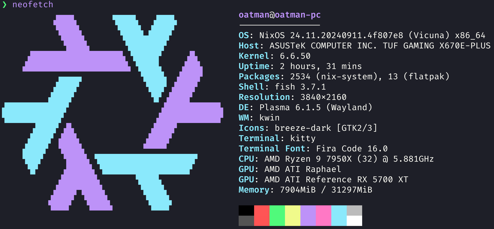

<sup>(YES I use NixOS, watch my video on it for details)</sup>

notes:

It seems like every time Bethesda release a new game using the Gambryo engine (Skyrim, Fallout, etc), I build a new PC.

This means every 4 years or so, though as Todd Howard slows down, so do I. That's probably a good thing, Thanks Todd.
Starfield was released late last year, so I began considering the rebuild then, and took delivery of the parts at the start of January.

My main editing & gaming PC is currently built around:

- an AMD Ryzen 7950X,
- With 32GB of RAM, (which I plan double in a few months)
- and an AMD 5700 XT that I traded my old equivalent nVidia card for.

---

```sh
$ sway

Proprietary Nvidia drivers are NOT supported.
Use Nouveau. To launch sway anyway, launch with
"--my-next-gpu-wont-be-nvidia" and DO NOT report issues.
```

I adore the AUDACITY of the swaywm developers.

notes:

- If you're running linux, you should be running AMD GPUs, nVidia seem to hate linux, for some reason?
- I used to think hardware accellerated graphics and games sucked on linux, or required lots of manual tweaking.
- but after trying my first non-nvidia card, I now realise that it's actually a closed-source driver vendor problem, not an O/S problem.
- I also realised my monitor supported HDR, something that the nvidia drivers just didn't enable!
- Anyway, the parts for this supercomputer that will last me another half-decade, cost less than $500, which it always does.

---

# If you're using Linux, always buy used hardware

No exceptions

notes:

These occasional standard replacement PC parts are the only time I buy new, nearly every other piece of hardware I own is second hand.
I like this not just for the price advantage, but to swerve the highs and lows of being an early-adopter.

I still have modern stuff: I just let the internet beta test it and bugfix for me for a year first!

---

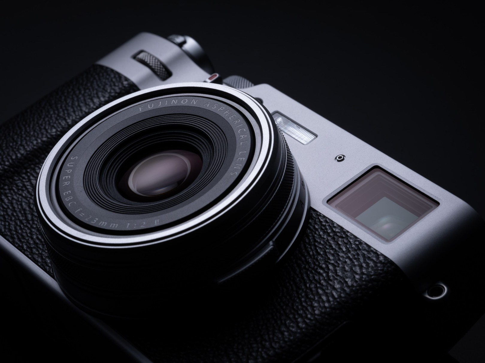

# X100v

notes:

3:38

As one of the fortunate Youtubers who doesn't need to show their face, I don't have a very complex camera setup, however, I have been a keen amateur photographer ever since Fujifilm's X100 camera smashed onto the scene a decade ago.

Over the last few years, I've burned through most of the budget Fujifilm-X line of cameras, mostly pairing them with TERRIBLE cheap manual-focus chinese lenses, which I love. The exception (which you can see in action in the teaser videos for Modem Prometheus Season 1) is the Mitakon Speedmaster mkII, a 35mm f/0.95 lens. That thing DRINKS in light and makes everything look amazing.

Currently, I have the previous-gen X100, the V I think, permanently on an arm next to my monitor, using it as a expensive webcam when in video chats with my mentoring clients, or playing D&D virtually with my friends!

I love taking photos of people with this camera, and not having an interchangable lens means I'm off the gear aquisition treadmil, at least for lenses, at least, for now.

---
<split even>
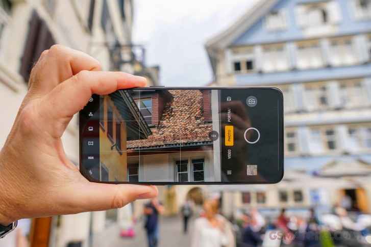

&nbsp;
&nbsp;

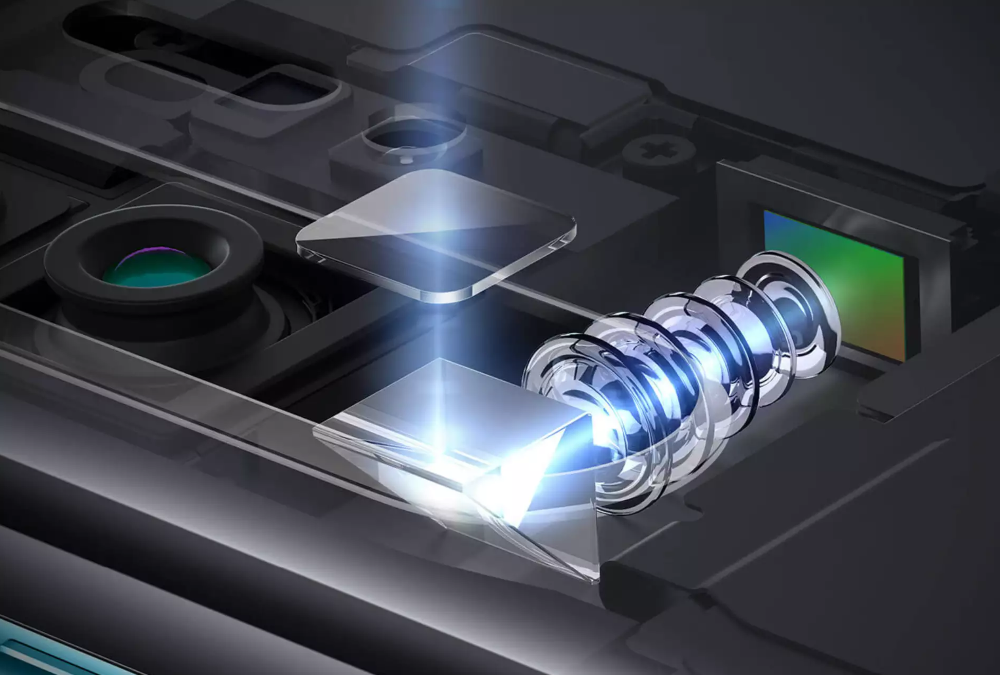
</split>

### This is, frankly, futuristic magic

notes:
Having said that, I know that the best camera is the one you have with you, which is why for a few years I've only considered phones with periscope optical zoom lenses in them (huawei, then samsung, then google, now back on samsung). Always having a 135mm telephoto lens in your pocket is astonishingly useful!

---

<split even>

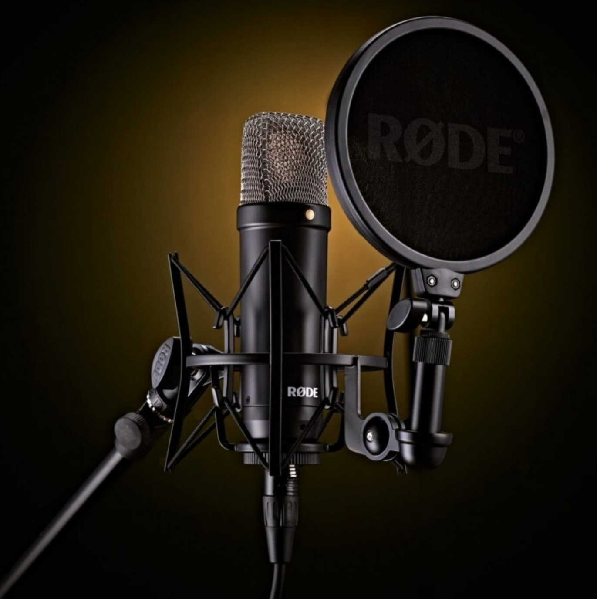

&nbsp;
&nbsp;

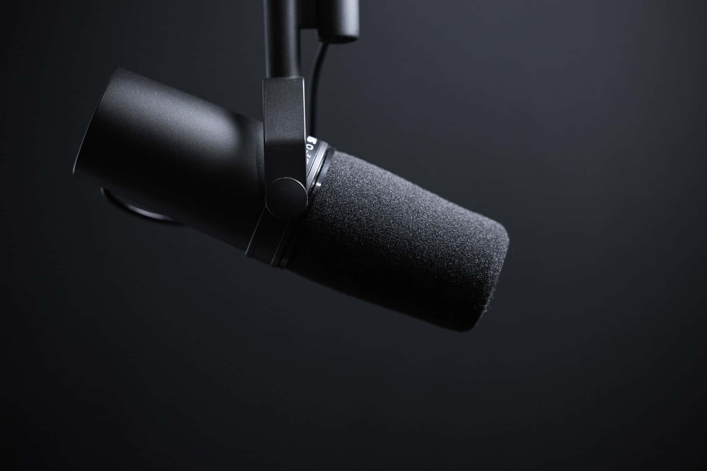

</split>

NT-1 &nbsp; &nbsp; &nbsp; &nbsp; &nbsp; &nbsp; &nbsp; &nbsp; &nbsp; &nbsp; &nbsp; &nbsp; &nbsp; &nbsp; &nbsp; &nbsp; &nbsp; &nbsp; &nbsp; &nbsp; Shure SM7b

notes:

### Mics

I would LOVE for the RODE NT1 v5 USB 32 bit floating point mic to work for me, but I just prefer how I sound out of the ubiquitous SM7b.
I spent years trying every mic but the 7b, thinking it was clichéd or boring.
6 months ago, I realised those are just synonyms for 'industry standard' and now happily use it for recording onto a Zoom H4 Essential, in 32-bit float sampling.

The whole mic and recording setup is airgapped from my pc and mains power, due to cross-talk and interference messing up a few of my recordings in the past.

Never again.

---

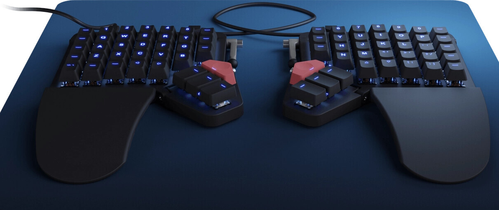

## Zsa Moonlander

notes:

I type all day, so even tiny increases in comfort are worthwhile for me.

Throughout my career, I've always a big fan of mechanical keyboards.
5 years ago, I got hooked on the split ZSA Ergodox ortholinear keyboard, and have since bought every keyboard the company has built, I own two Moonlanders and their latest lightweight portable version, Voyager.

The moonlander is the perfect keyboard, save up and buy it, your hands will thank you.

---

<split even>

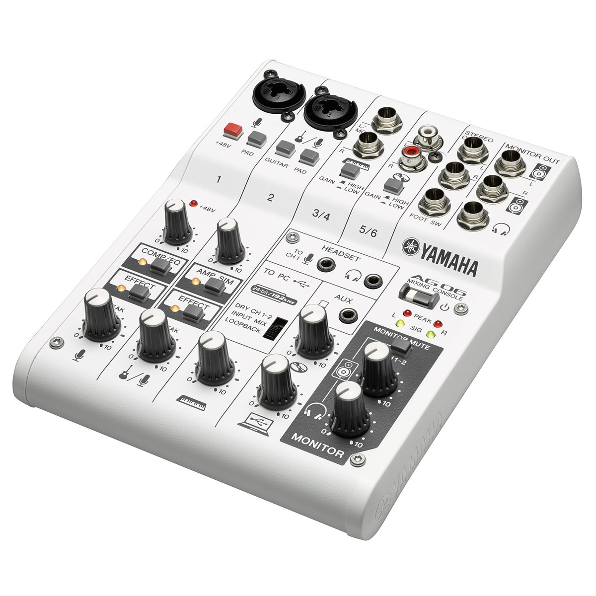

&nbsp;
&nbsp;

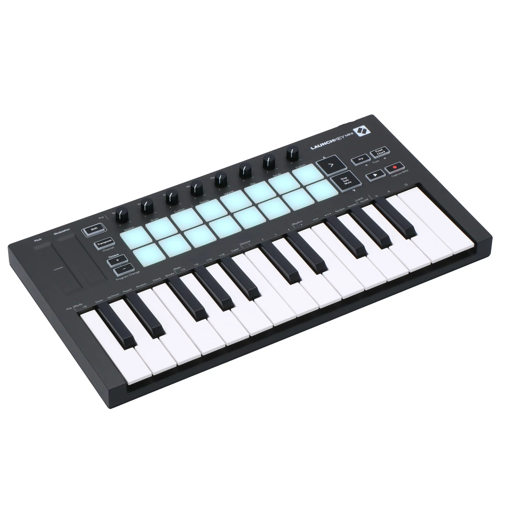

</split>

##### Left: Yamaha AG06

##### Right: Launchkey Mini MK3

notes:

### Music Production Hardware

Yamaha AG06 usb interface for connecting wierd cheap ebay synths to, and a Launchpad Mini Mk3 for controlling my music production software

---

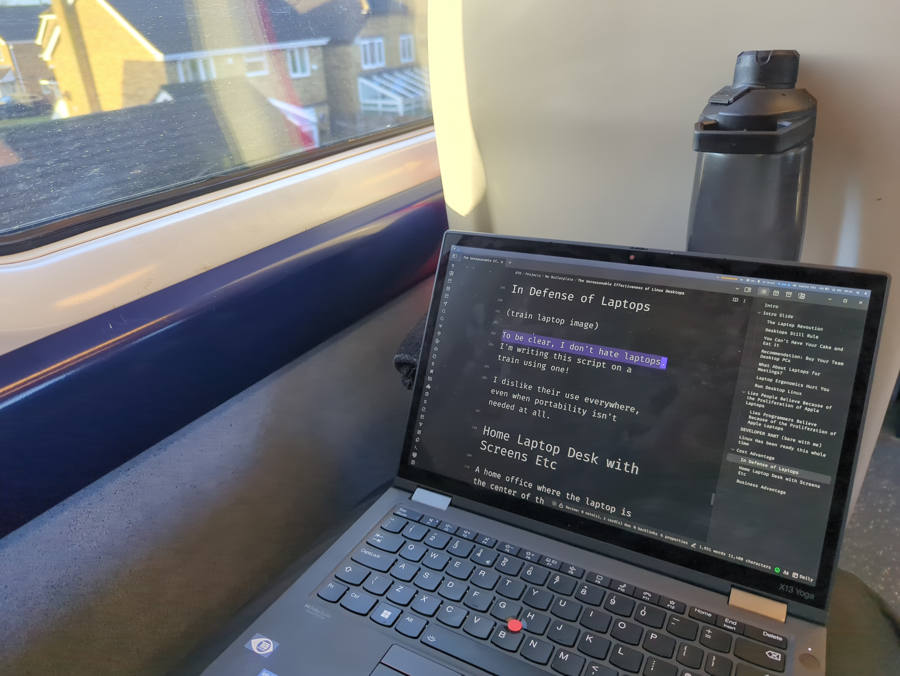

##### Thinkpad X13 Yoga Gen 3

notes:

### Laptop

For on-the-go writing and coding, I have a 2yo Thinkpad X13 yoga, and it's the nicest laptop I've owned, including my brief flirtation with apple silicon macbooks.
If I need to write on a train, like here, it comes with me.

---

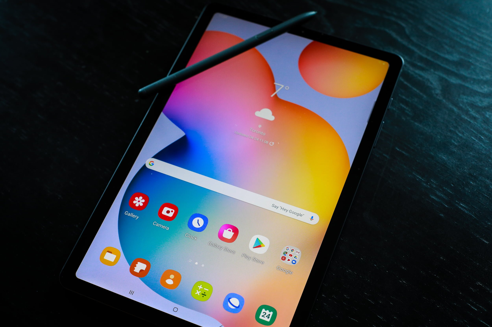

#### Samsung Galaxy Tab S6

notes:

In the mornings, I write for two hours on a 2019 Samsung Galaxy Tab S6 (the earliest samsung tablet with pen support), on which I've removed or disabled every app except for Obsidian. This is my distraction-free environment.
I got it in pink because it was fully 20% cheaper on ebay than in black. Ah, fragile mascilinity.

When in this morning writing mode, I wear Sony XM4 noise-cancelling headphones, the last in the XM line before they copied airpods max and became much, much worse.

---

# Part 3

# Software

notes:

- [ ] nixos - production must be totally stable
  - perfect rollback, but also if something goes wrong, everything's not ruined, I can still install packages, I can continue working
- [ ] window manager: anything with tiling: kwin, sway, gnome tiling

I use ALMOST exclusively open source linux-based software.
I am a sort of 'open source pragmatist' in this regard:

---

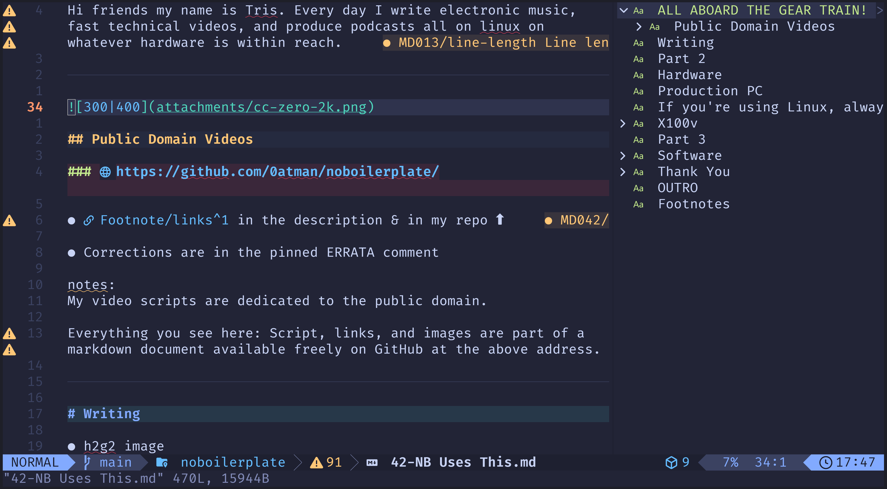

#### Eg. Editing this video script in neovim

notes:
I run as much Open Source as I can, but I also don't lose sight of practicality, or interoperability and longevity of my data.
An example: I run my life on the Obsidian.md knowledge platform, despite the core of it being closed source because the data it operates on is simple, plain-text Markdown.

Let's compare this to, say, Joplin, an open-source desktop note-taking tool that runs a sqlite database behind the scenes.
If (and when) Obsidian is abandoned by its two developers, I still have all my data in markdown and can continue using it in standard text editors.
If I want to move away from Joplin, my data is stuck in a non-standard binary blob of sqlite and I have to write some code to get it out, or use it.

I'll take open data over open source every day of the week.
But ideally, I'd like both. Maybe when Logseq is good enough.

---

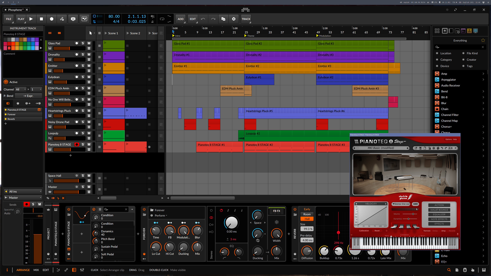

#### bitwig.com

notes:
For music I use Bitwig, an Ableton Live clone, which launched in 2014 with linux support and allowed me in a single stroke to finally leave music production on windows behind me.
I have happily paid the license every year since then - companies building professional-grade software for linux get my money!

---


#### reaper.fm

notes:

And about 3 years ago I rediscovered the dark horse that is Reaper.fm, which is the best audio editor I've ever heard of, let alone used. It's got more features than every other expensive commercial editor combined, and the only reason I think it is less well known than it should be,
is that it looks like it was made for windows 95.

Reaper also edits video, doing everything I need it to do there, too.

The biggest feature that surprises video producers I talk to is that reaper never crashes.
Weird and slightly concerning, that that should be an impressive feature!

---

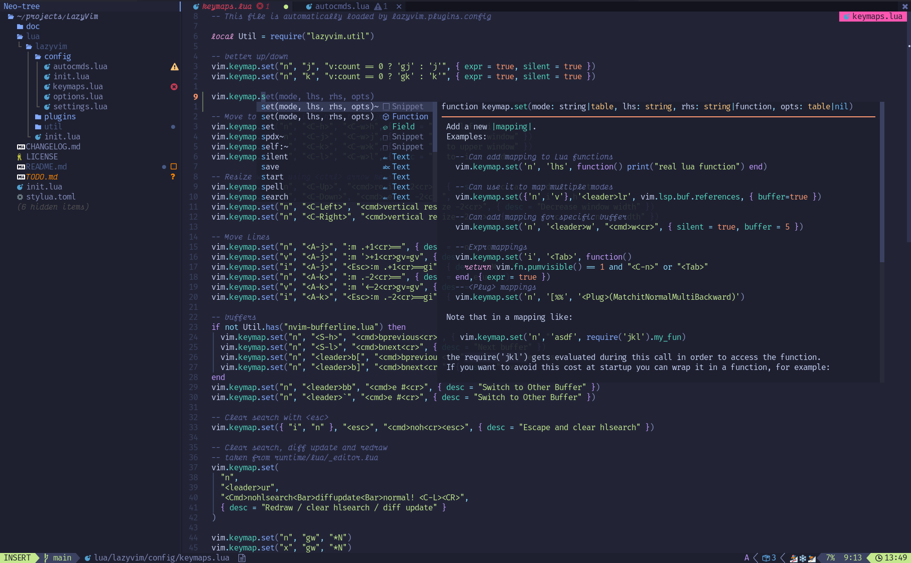

#### Lazynvim.org

notes:

#### Coding

I mostly code rust inside neovim, with whatever defaults the framework Lazynvim uses. I only make one change, adding obsidian.nvim to my plugins, which allows vim to understand obsidian's links, tags, backlinks, and other basics.

While I dig emacs, too - spacemacs was my gateway to DOOM emacs - I found the platform's embedded terminal and async features lacking compared to neovim.
I try basically every editor approximately every year, just to see what's good. My axes must be sharp.

When pair programming I have found nothing better than vscode liveshare combined with tmate.io terminal sharing.

---

# Open Source Production

# _Rules!_

notes:

Thanks to my standardisation on linux and mostly open source tools, I am not held back by my hardware or software.

I could do all my coding and production on a raspberry pi powered by a solar panel.

As someone who now pays the bills by my creative output, this allows me to sleep at night very, very soundly.
