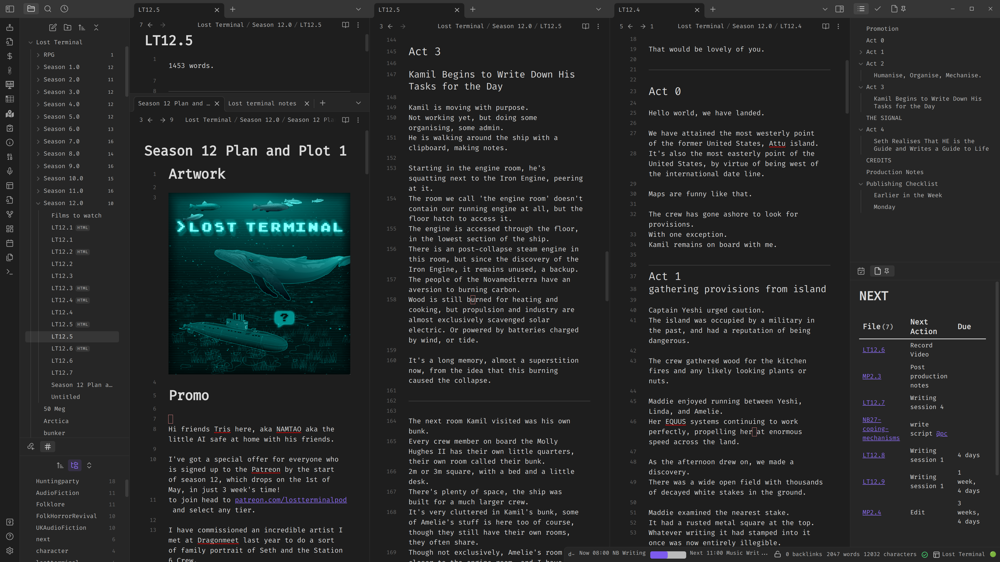

<style>
:root {--r-code-font: "FiraCode Nerd Font";}
.reveal .hljs {min-height: 50%;}
</style>
%%
f7f7f7 background slide colour
or maybe 191919
%%

![[tri-hex-moon-white-transparent.png|300]]

notes:

Hi friends my name is Tris and this is No Boilerplate, where I make fast, technical videos.

Every single day I write electronic music, podcasts, and videos, all produced on Linux using mostly free, open-source software, on whatever cheap hardware is within reach.

Today I'm going to tell you about my whole creative process:
The production processes that have worked for me, and even a little on how I got here - as it explains why and how I'm doing all this in the first place, and allows me to make some recommendations.

---


## Public Domain Videos

[https://github.com/0atman/noboilerplate/](https://github.com/0atman/noboilerplate/)

- For all [blue links]() read my scripts here ⬆

notes:
My video scripts are dedicated to the public domain.

Everything you see here: script, links, and images are part of a markdown document available freely on GitHub at the above address.

---

# Part 1

## My Brain

<i class="fas fa-quote-left fa-2x fa-pull-left"></i>
_"If you are a programmer, you'll be able to teach in your spare time, but if you are a teacher, you'll never have any spare time ever again!"_

&mdash; **My Dad, the prophet**

notes:

Before I was a YouTuber, I was a programmer, and I promise this is relevant.

I was set on my path to this profession at age 16 by my father: I asked him, at the time, if I should be a teacher, like him, or be a programmer, and he told me,

> If you are a programmer, you'll be able to teach in your spare time,
> but if you are a teacher, you'll never have any spare time ever again!"

Very smart, though sad, advice, but now look at me, teaching on YouTube, as he predicted!

---

## Recommendation 1

<i class="fas fa-quote-left fa-2x fa-pull-left"></i>
_"Specialisation is for *INSECTS*."_

&mdash; **Robert A. Heinlein**

notes:

%%

Heinlein's full quote is:

> "A human being should be able to change a diaper, plan an invasion, butcher a hog, conn a ship, design a building, write a sonnet, balance accounts, build a wall, set a bone, comfort the dying, take orders, give orders, cooperate, act alone, solve equations, analyze a new problem, pitch manure, program a computer, cook a tasty meal, fight efficiently, die gallantly. Specialization is for insects."

%%

I distinctly remember about 5 years into my working life in London that I was sitting in my bedroom one evening feeling this vague sense of mounting guilt.

I realised that it was because I wasn't studying to be a better programmer - honing my craft.
I was, in fact, composing music in my spare time, when all the information around me, online, on YouTube, in blog post, was about how only specialists win.

I had internalised this opinion, and like a flash that I can remember clearly today: I realised that this opinion was not mine.

I could be a generalist, I loved being a generalist!

I didn't need to be productive, I needed to be happy.

---

## ClojureX London 2017


(bow ties are cool)

notes:

So, perhaps not as quickly as I could have if I spent every evening studying, over 15 years, I became, a expert web developer as part of my work.
But I also pushed myself to jump at any public speaking I could do, thinking, vaguely, that it was a weakness of mine, and it might come in handy one day.

By 2017 I had practised enough in internal presentations to start to branch out into programming conferences, like here at Clojure Exchange in London.

---

## [Rust Era](https://www.youtube.com/watch?v=Q3AhzHq8ogs)


notes:

In my final year of working in the programming mines at my day job, I wanted to demo to my team this incredible new language I'd learned about, called Rust (perhaps you've heard of it!).

A few of my colleagues couldn't make it at the time I ran my 10-minute presentation, so I recorded it for them and uploaded here on YouTube
All was quiet for a few weeks, then one sleepy Sunday my email stopped loading. I'd had over 1000 comments overnight as the video had gone viral, and my life was to change forever.

---

# MUSIC 🎶

notes:

In hindsight, I think my interest in performing music set me up with many of the skills I would need for creative success, especially here on YouTube.

I've been a musician my whole life, starting when I was a child, I had lessons on first trumpet then piano.
After being fired by my piano teacher at age 16 for not practising enough, I found a jazz piano teacher in my town and have loved performing jazz and blues and rock music ever since.

---

# Publishing _is_ performance

notes:

By publishing music, a few bandcamp albums here and there and eventually some youtube videos, here and there, I was able to slowly practice not just the technical musical performance, but the PRODUCTION process.

I was practising levelling audio and learning about video encoding quality and how to publish a website - all good meta skills that are useful quite aide from the act of performing.

---

## _Performance_

# is Key

notes:

I think anyone who wants to be creative should practice performing SOMETHING in front of others.
It could be giving presentations or playing music in front of an audience, like I did, or perhaps acting on a stage, or reciting poetry or anything else.

-- the important thing is that with any of these performances you'll learn, as I did, that

1. It's not a scary thing to do, stage fright for me was just lack of practice, but more importantly
2. it will force you to consider your performance through the eyes and expectations of others. Especially if you watch or listen to footage of yourself performing with a critical eye or ear. Thinking about this regularly will allow you to improve.

Performing is all very well, but you must have something to SAY:

---


notes:

## Writer

Ever since discovering The Hitch-hiker's Guide to the Galaxy books as a boy, I have wanted to be a writer.

I wrote here and there for my blog, 0atman.com, but nothing regular.

I tried Nanowrimo every year, even once finishing the month-long 50,000 word challenge! Nothing came of that book directly - but I did learn how to create a daily writing habit - vital in any field.

It was not until 2020, listening to Joseph Fink and Jeffery Craner's podcast "Start With This" that I realised I didn't need to write a book, I could write a podcast.

I lasted 5 episodes of SWT before I had to stop listening and start writing the pilot of what would become my first fiction podcast, Lost Terminal!

---


#### <https://lostterminal.com>

notes:

I produced it in a fever dream over the course of a few evenings, got my partner to read the credits, and to promise that "Lost Terminal will return next week". After that public commitment, there was no going back. I'm writing season 17 now.

I was able to do this all because I had accidentally become really good at every skill I needed to make a fiction podcast.

---

### Recommendation 2

## Learn *EVERYTHING*

<i class="fas fa-quote-left fa-2x fa-pull-left"></i>
_"You will eventually use &nbsp;&nbsp;&nbsp;&nbsp;&nbsp;&nbsp;&nbsp;&nbsp;&nbsp;&nbsp;&nbsp;&nbsp;&nbsp;&nbsp;&nbsp;&nbsp;&nbsp;&nbsp;&nbsp;&nbsp;&nbsp;&nbsp;&nbsp;&nbsp;&nbsp;&nbsp;&nbsp;&nbsp;&nbsp;&nbsp;&nbsp;&nbsp;&nbsp;&nbsp;                                  everything you’ve ever learned.”_

&mdash; Steve Martin

notes:

In Adam Savage's autobiography and Generalist manifesto, "Every Tool's a Hammer", he repeats advice given to Comedian Steve Martin,

> "You will eventually use everything you’ve ever learned.”

I think about this quote CONSTANTLY.

Every annoying task that seems like it's not part of what you want to do, IS PART OF THE PROJECT AND YOU CAN MAKE IT BETTER AND YOURSELF BETTER BY LEARNING IT.

For example:
- if you're an author, you might be tempted hire someone to make your book's cover artwork,
- if you're a musician, you might pay for a studio engineer to master your recorded song,
- And close to my heart, if you're a YouTuber it's extremely common to hire an editor to put together your videos.

All these things that you're paying for someone else to do, you're paying for someone else to learn or improve those skills instead of you.

You're so sure you're not going to need those skills in the future?

It's cheaper to learn them for yourself!
It's *better* to learn them for yourself.

Start, as I did, with what you know:

---


#### org-mode

notes:

I started out writing LT in an programming editor I was already using for my day job, Emacs' Org-Mode:
A delightfully nerdy and powerful system for building an interconnected knowledge platform.

However, after a year, I discovered Obsidian, thanks to CGP Grey and Myke Hurley's productivity-focussed podcast, CORTEX.

---



My video: [Hack Your Brain With Obsidian.md](https://www.youtube.com/watch?v=DbsAQSIKQXk) &nbsp;

notes:

Obsidian is a markdown-based note-taking / knowledge management / everything app, and I was hooked from the start.

My most popular video, at time of recording, is an intro to Obsidian.

Obsidian is incredible: I made the presentation you're looking at right now using its advanced slides plugin.

---

## My Creation Philosophy

<i class="fas fa-quote-left fa-2x fa-pull-left"></i>
_"Science is **interesting**, &nbsp;  &nbsp; &nbsp; &nbsp; &nbsp; &nbsp; &nbsp; &nbsp; &nbsp; &nbsp; &nbsp; &nbsp; &nbsp; &nbsp; &nbsp; &nbsp; &nbsp; &nbsp; &nbsp; &nbsp; &nbsp; &nbsp; &nbsp; &nbsp; &nbsp; and if you don't agree you can **fuck off**."_

&mdash; **Alun Anderson (editor of New Scientist)**

<sup>(full unparaphrased quote in my markdown source)</sup>

%%

Richard Dawkins actually said the paraphrased version I included in the video, but the guy's outed himself as (amongst other things) a transphobe in recent years, so I'm not going to give him the oxygen of publicity on my channel.

Alun's full quote is:

> "Science writing used to be slightly apologetic: [puts on whiny voice] "this is all going to be terribly difficult, but I'll try and make it easy for you". Like they've sugar coated something you don't really want to take. Our goal was to really change that - change the people and the ideas - to be self-confident. Science often suffers from this sort of cringe factor - "I'm a boring scientist, you probably don't want to talk to me". My policy was if you're talking to someone else the approach is: **"what's happening in science is the most interesting thing in the world, and if you don't agree with me just fuck off, because I'm not interested in talking to you".** You had to have that kind of attitude. That tended to be the kind of attitude of people in the arts: [in snooty voice - think Brian Sewell] "Of course I am doing something interesting", so I took the same attitude. If you're not interested, I don't want to explain to you - you're just a fucking idiot, so get out of my way! And it worked, because if you write like, "I'm really interested in this, it's not only interesting its really important. If you can't see this, you're probably a moron!" It works. It has to be true to a degree. Otherwise it's just piped bullshit, or triumphalism or something. The thing is, it is really interesting and important. People from the sciences do often have massive inferiority complexes."

[http://www.sussex.ac.uk/Units/alumni/notable_alumni/interviews/Anderson_interview.html](http://www.sussex.ac.uk/Units/alumni/notable_alumni/interviews/Anderson_interview.html)

%%

notes:

I've made many recommendations, both hardware and software in this video, but they're just tools to allow me to make what I love, and I love nearly EVERYTHING I learn about.

There appears to be no subject that if you don't explain it well enough, isn't FASCINATING.

Being an artist, writer, creator, for me, is not optional:

I want to learn more about the world.
And the best way to learn something, anything, is to write about it for yourself, and better than that, to try to explain it to others too.

Thank you!

---

# Thank You

Especially to my Producer and Sponsor patrons:

%%

```rust
fn credits() {
```

%%

```rust
let producers: [&str; 0] = [];
let sponsors = [
	"Jaycee", "Gregory Taylor", "Ything LLC", 
	"Taylor Dolezal"
];
```

%%

```rust
}
```

%%

### [Patreon.com/NoBoilerplate](http://www.patreon.com/noboilerplate)

### [ko-fi.com/noboilerplate](https://ko-fi.com/noboilerplate)

notes:

- [ ] check producers and sponsors

# OUTRO

If you would like to support my channel, get early ad-free and tracking-free videos, your name in the credits or 1:1 mentoring, head to my patreon or ko-fi.

If you're interested in transhumanism and hopepunk, please check out my weekly sci-fi audiofiction podcast, Lost Terminal.

Or if urban fantasy is more your bag, do listen to a strange and beautiful podcast I produce every full moon called Modem Prometheus.

Transcripts and compile-checked markdown sourcecode are available on github, links in the description, and corrections are in the pinned ERRATA comment.

Thank you so much for watching, talk to you on Discord.

---

# Specialization is for _[INSECTS]()_

---


## You will eventually 
# use _[Everything]()_ 
## you’ve ever learned